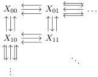

bisimplicial set $X$:

The arrows indicate the degeneracy and face maps. Now we go back to consider the maps $d_m \square d_n$. When $m = n = 0$ then we simply get a map $\emptyset \to \Delta[0] \square \Delta[0]$, and allow us to introduce the type

$$\vdash \mathsf{Set}_{00} \mathsf{Type}.$$

When $n = 0$ the resulting subset of maps is of the form

$$d_m \square \Delta[0] : \partial \Delta[m] \square \Delta[0] \to \Delta[m] \square \Delta[0].$$

In this setting, since for $m = 0$ we obtain the previous cofibration $\emptyset \to \mathbf{1}$, for each $m \ge 1$ we can write the following types:

- \(x, y: \mathsf{Set}_{00} \vdash \mathsf{Set}_{10}(x, y)\) Type.
- \(x, y, z: \mathsf{Set}_{00}, f: \mathsf{Set}_{10}(x, y), g: \mathsf{Set}_{10}(y, z), h: \mathsf{Set}_{10}(x, z) \vdash \mathsf{Set}_{20}(x, y, z, f, g, h)\).
：

When $m = 0$ we obtain the theory of the categorical direction. Now suppose that $m = 1 = n$, then resulting generating cofibration is the map

$$d_1 \square d_1 : \partial \Delta[1] \square \Delta[1] \coprod_{\partial \Delta[1] \square \partial \Delta[1]} \Delta[1] \square \partial \Delta[1] \to \Delta[1] \square \Delta[1]$$

From here we see that the type associated to this map has the following form:

$$\begin{array}{l} x_0, x_1, x_2, x_3: \mathsf{Set}_{00}, f_{01}: \mathsf{Set}_{01}(x_0, x_1), f_{23}: \mathsf{Set}_{01}(x_2, x_3), f_{02}: \mathsf{Set}_{10}(x_0, x_2), \\ f_{13}: \mathsf{Set}_{10}(x_1, x_3) \vdash \mathsf{Set}_{11}(x_0, x_1, x_2, x_3, f_{01}, f_{23}, f_{02}, f_{13}) \mathsf{Type}. \end{array}$$

We think of this new type as the type of squares where the solid boundary is the given context

51