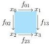

For different $m, n$ the context are simply more involved, but the dependencies can be inferred. Note we still need to add the degeneracy operators satisfying the usual axioms. We can see that as we build more complex contexts, it will be computationally difficult to obtain an explicit description of the types. We might instead proceed as in theorem 3.27.

**Example 3.35.** Two elements $x, y : \mathsf{Set}_{00}$ are said to be *homotopic* if there exists $\alpha : \mathsf{Set}_{10}(x, y)$. This sentence only involves types in the language of Segal spaces. In contrast to topological spaces, we can express the fact that two maps are homotopic.

*Remark 3.36.* Note in particular that the language of spaces or Kan complexes is available for us to use. This in combination with our construction in section 3.7 allow us to realize many properties of (complete) Segal spaces, for example the ones found in [Ras23], are written in this language.

### 3.9 Functors and Isofibrations

We denote $[1] := \{0 \to 1\}$ the category with two objects and single non-identity arrow. This category can be viewed as a Reedy category in two ways. The first one respects the direction of the arrow, so we take $[1]_+$ to be the non-identity map, while for the second we take the same map to be in $[1]_-$. Recall that if $K$ is a Reedy category, then $K^{\mathsf{op}}$ is also a Reedy category where $(K^{\mathsf{op}})_+ = K_-$ and $(K^{\mathsf{op}})_- = K_+$. In order to match the computations of theorem 3.28, we use the same notation as there. By which we mean that for a model category $\mathcal{C}$ we use $\mathcal{C}^{([1]_+)^{\mathsf{op}}}$ and $\mathcal{C}^{([1]_-)^{\mathsf{op}}}$ with the corresponding Reedy model structures, ignoring the fact that $\mathcal{C}^{([1]_+)^{\mathsf{op}}} = \mathcal{C}^{[1]_-}$ and $\mathcal{C}^{([1]_-)^{\mathsf{op}}} = \mathcal{C}^{[1]_+}$.

**Proposition 3.37.** *The Reedy model structure on $\mathcal{C}_{Reedy}^{([1]_-)^{\mathsf{op}}}$ coincides with the projective model structure. In particular, weak equivalences and fibrations are the level-wise weak equivalences and fibrations in $\mathcal{C}$.*

*Proof.* This is a classical and well-known result. $\square$

We are interested in the particular case of $\mathcal{C} = \mathbf{Cat}$. It is immediate to see that all objects are fibrant. The language we obtain should be the

52