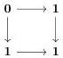
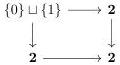
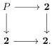
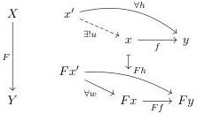

which we now compute for $i \in I$, so the pictures take the following form:

From the above we deduce that the type axioms introduced by these cofibrations take, respectively, the following form:

$$x : X_0 \vdash X_1(x) \text{ Type},$$

$$x, y : X_0, f : X_0(x, y), a : X_1(x), b : X_1(y) \vdash X_1(a, b, f) \text{ Type},$$

$$x, y : X_0, f : X_0(x, y), a : X_1(x), b : X_1(y), j, k : X_1(a, b, f) \vdash j =_{X_1(a, b, f)} k \text{ Type}.$$

Unlike the language for functors $\mathbb{L}^{Fun}$, here we do not need a symbol for $F : X_0 \to X_1$. We denote this language for isofibrations as $\mathbb{L}^{Iso}$.

For the observation below, it will be useful to remember that given a functor $F : X \to Y$, an arrow $f : x \to y \in X$ is cartesian if for any $h : x' \to y$ and $w : F(x') \to F(x)$ with $F(f) \circ w = F(h)$, there exists a unique $u : x' \to x$ such that $f \circ u = h$. The following diagram illustrates this definition:

A Grothendieck fibration is a functor $F : X \to Y$ such that for any $y \in Y$ and $f : a \to F(y)$, there exists a cartesian arrow $\phi_f : f^*y \to y$ such that $F(\phi_f) = f$. The functor $F : X \to Y$ is a Street fibration if for any $y \in Y$ and $f : a \to F(y)$, there exists a cartesian arrow $\hat{f} : e \to y$ and an isomorphism $F(e) \cong a$ that makes the resulting triangle commutative.

Remark 3.39. It is a classical result that a Grothendieck fibration is the same as a Street fibration which is also an isofibration. On the one hand, note that a Grothendieck fibration can be written in the language $\mathbb{L}^{Iso}$ of isofibrations, but not in $\mathbb{L}^{Fun}$ of functors since it contains an equality between objects,

55