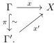

for any object $X \in \mathcal{N}$, and cofibrant object $C \in \mathcal{M}$, any map $v : C \to G(X)$ corresponding to $\tilde{v} : F(C) \to X$, and $\phi \in \mathbb{L}_{\lambda}^{\mathcal{M}}(C)$.

This immediately imply the following proposition that shows that the map $h\mathbb{L}_A$ mentioned in the $4^{th}$ invariance theorem is well-defined.

**Proposition 4.6.** *For any Quillen adjunction $F : \mathcal{M} \leftrightarrows \mathcal{N} : G$ and $A \in \mathcal{M}$ a cofibrant object, the map $F : \mathbb{L}_{\lambda}(A) \to \mathbb{L}_{\lambda}(FA)$ is compatible with the relation $\approx$ and induces a morphism of $\lambda$-boolean algebras*

$$F : h\mathbb{L}_{\lambda}(A) \to h\mathbb{L}_{\lambda}(FA).$$

*Proof.* If $\phi$ and $\psi$ are semantically equivalent formulas in $\mathbb{L}_{\lambda}(A)$, then for any fibrant object $X \in \mathcal{N}$, and a map $\tilde{v} : FA \to X$ corresponding to $v : A \to GX$ we have

$$X \vdash F(\phi)(\tilde{v}) \Leftrightarrow G(X) \vdash \phi(v) \Leftrightarrow G(X) \vdash \psi(v) \Leftrightarrow X \vdash F(\psi)(\tilde{v})$$

which shows that $F(\phi) \approx F(\psi)$ and concludes the proof. $\square$

We are now ready prove the $3^{rd}$ invariance theorem. We start with a special case:

**Lemma 4.7.** *Let $\Gamma, \Gamma' \in \mathcal{M}^{\mathrm{COF}}$ and $\pi : \Gamma \xrightarrow{\sim} \Gamma'$ be a core trivial cofibration, then the induced map $h\mathbb{L}_{\lambda}^{\mathcal{M}}(\Gamma) \to h\mathbb{L}_{\lambda}^{\mathcal{M}}(\Gamma')$ is an isomorphism of $\lambda$-boolean algebras.*

*Proof.* Assume that $\pi : \Gamma \xrightarrow{\sim} \Gamma'$ is a core trivial cofibration. Since to define the language of $\mathcal{M}$ we take the $\kappa$-clan $(\mathcal{M}^{\mathrm{COF}})^{\mathrm{op}}$, when constructing the language we get a covariant functor $\mathcal{M}^{\mathrm{COF}} \to \mathbf{Bool}_{\lambda}$. Therefore, we obtain a map $\pi^* : \mathbb{L}_{\lambda}^{\mathcal{M}}(\Gamma) \to \mathbb{L}_{\lambda}^{\mathcal{M}}(\Gamma')$ and its left adjoint $\exists_{\pi} : \mathbb{L}_{\lambda}^{\mathcal{M}}(\Gamma') \to \mathbb{L}_{\lambda}^{\mathcal{M}}(\Gamma)$, which furthermore descends to the adjoint pair $h\exists_{\pi} : h\mathbb{L}_{\lambda}^{\mathcal{M}}(\Gamma') \rightleftarrows h\mathbb{L}_{\lambda}^{\mathcal{M}}(\Gamma) : h\pi^*$ between the $\lambda$-boolean algebras.

We claim that $h\exists_{\pi}$ is the inverse for $h\pi^*$. It is enough to show that for any $\phi : \mathbb{L}_{\lambda}^{\mathcal{M}}(\Gamma)$ and $\psi \in \mathbb{L}_{\lambda}^{\mathcal{M}}(\Gamma')$ we have $\exists_{\pi}\pi^*(\phi) \approx \phi$ and $\pi^*\exists_{\pi}(\psi) \approx \psi$.

Firstly, let $X \in \mathcal{M}^{\mathrm{FIB}}$ be a fibrant object and $x : \Gamma \to X$. Note that $x \in |\exists_{\pi}\psi|_X \subseteq \mathrm{hom}_{\mathcal{M}}(\Gamma, X)$ if and only if there exists $x' : \Gamma' \to X$ such that $x' \in |\psi|_X \subseteq \mathrm{hom}_{\mathcal{M}}(\Gamma', X)$ and that makes the following triangle commutative:

58