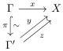
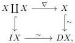
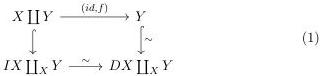

Since $X$ is fibrant, the map $x'$ always exists. Such $x'$ is not necessarily unique, however, in a situation in which we have two arrows

that make the triangle commutative, then using that $\pi$ is a trivial cofibration we see that $y$ and $z$ are homotopic. By the first invariant theorem (theorem 2.38) we have $y \in |\psi|_X$ if and only if $z \in |\psi|_X$. Therefore, the existence of $x' \in |\psi|_X$ is independent of choices.

From here, the result is immediate: $x \in |\exists_\pi \pi^* \phi|_X$ if and only if there exists $x' : \Gamma' \to X$ such that $x'\pi = x$ such that $X \vdash \phi(\pi^* x')$ i.e., if and only $x \in |\phi|_X$. This shows that $|\exists_\pi \pi^* \phi|_X = |\phi|_X$ for any fibrant object. Conversely, for $y : \Gamma' \to X$ we have $y \in |\pi^* \exists_\pi \psi|$ if and only if there exists $z : \Gamma' \to X$ such that $z\pi = y\pi$ and $X \vdash \psi(z)$, which is equivalent to $y \in |\psi|_X$, showing that $|\exists_\pi \pi^* \psi|_X = |\psi|_X$. This concludes the proof that $h\exists_\pi$ is the inverse for $h\pi^*$.

We are now ready to prove the $3^{rd}$ invariance theorem:

Proof of the $3^{rd}$ invariance theorem: The idea is to use theorem 4.7 together with Brown's factorization lemma from [Bro73], or rather an adaptation of it to the setting of weak model structures that we present now. If $f : X \to Y$ is a weak equivalence between cofibrant objects in a weak model category. In general we cannot form a cylinder object for $X$, but instead a "weak cylinder" for $X$, that is a diagram:

we then take the pushout of this whole diagram by the map $X \to Y$, using either of the two canonical maps $X \to X \coprod X$:

59