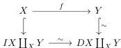
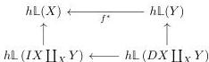
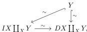
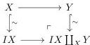
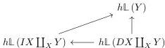

and by precomposing with the coproduct inclusion $X \rightarrow X \coprod Y$, we obtain a diagram:

three of the four maps here are weak equivalence, so it follows by the 2-out-of-3 property that the left vertical map is also a weak equivalence, hence a trivial cofibration. Applying $h\mathbb{L}$ we obtain a diagram:

The two vertical arrows are bijections because of theorem 4.7, so in order to show that $f^*$ is a bijection, it is enough to show that the bottom map is a bijection. This bottom horizontal map fits into a commutative diagram:

where the arrow $Y \rightarrow IX \coprod_X Y$ is obtained as the pushout:

Applying the $h\mathbb{L}$ functor, we get a triangle:

the two vertical and diagonal arrows are bijections because of theorem 4.7, and so the third, horizontal, arrows also is, which concludes the proof.

60