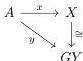

We can also show the injectivity part of the $4^{th}$ invariance theorem.

**Lemma 4.8.** *Let $F : \mathcal{M} \rightleftarrows \mathcal{N} : G$ a Quillen equivalence. Then, for any cofibrant object $\Gamma \in \mathcal{M}$, the induced map $h\mathbb{L}F_\Gamma : h\mathbb{L}_\lambda^\mathcal{M}(\Gamma) \rightarrow h\mathbb{L}_\lambda^\mathcal{N}(F\Gamma)$ is injective.*

*Proof.* Let $\phi$ and $\psi$ be formulas in $\mathbb{L}_\lambda^\mathcal{M}(\Gamma)$ such that $F(\phi) \approx F(\psi)$ *i.e.*, $F(\phi)$ and $F(\psi)$ are equal in $h\mathbb{L}_\lambda^\mathcal{N}(F\Gamma)$. We must show that $\psi \approx \phi$. Alternatively, by theorem 4.4 we can show that $\psi \approx_b \phi$. The Quillen equivalence induces an equivalence between homotopy categories $Ho(G) : Ho(\mathcal{N}^{\mathrm{BiF}}) \rightarrow Ho(\mathcal{M}^{\mathrm{BiF}})$. Hence, there is a bifibrant object $Y \in \mathcal{N}$ such that $GY$ is isomorphic to $X$ in $Ho(\mathcal{M}^{\mathrm{BiF}})$. Given any $x : \Gamma \rightarrow X$, denote by $y : \Gamma \rightarrow GY$ any map such that the following triangle

commutes in $\mathrm{Ho}(\mathcal{M}^{\mathrm{BiF}})$. Lastly, let $y' : F\Gamma \rightarrow Y$ the transpose of $y$ via the Quillen adjunction. It follows from the first invariance theorem 2.38 that $X \vdash \phi(x)$ if and only if $GY \vdash \phi(y)$. From theorem 4.6, this is equivalent to $Y \vdash F(\psi)(y')$. By assumption $F(\phi) \approx F(\psi)$, so $Y \vdash F(\psi)(y')$. Again, this is $GY \vdash \psi(y)$ and $X \vdash \psi(x)$. This establishes the equality $|\phi|_X = |\psi|_X$ for all $X \in \mathcal{M}$ bifibrant, which proves $\psi \approx_b \phi$, and hence $\psi \approx \phi$. This concludes the proof of the statement. $\square$

We now explain our strategy to prove the rest of theorem 4.2, that is the surjectivity part of the $4^{th}$ invariance theorem.

In [Bar19], Reid Barton constructs a model 2-category structure on the 2-category of simplicial model categories. The trivial fibrations satisfy a property, that Barton called “extensible” (see theorem 4.9). In this section, we introduce a version of these in the non-enriched case, and we call those functors *Barton trivial fibrations*. In section 4.2 we show that the result holds for Barton trivial fibrations. After that, the idea is to use the same strategy as for the proof of the $3^{rd}$ invariance theorem based on this modified Brown factorization lemma to conclude the result holds for general Quillen equivalences. We could do this immediately for combinatorial simplicial model categories using Brown’s lemma in Barton’s model structure, but for the general case we give a direct proof of the existence of the appropriate diagram which is inspired by how it would be done in Barton’s model structure, but without relying on it directly. This is done in theorem 4.52 using section 4.3.

61