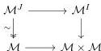
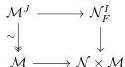

categories $RM$ and $PM$ will be constructed as certain category of functors $\mathcal{M}^J$ and $\mathcal{M}^I$, equipped with certain localization of the Reedy model structure. So we get a diagram

where the arrow on the left and the two maps $\mathcal{M}^I \rightarrow \mathcal{M}$ induced by the projections are Barton trivial fibrations. More precisely, the construction we do takes as input a left Quillen equivalence $F : \mathcal{M} \rightarrow \mathcal{N}$ between weak model categories and produces a diagram

where again the arrow on the left and the two maps $\mathcal{N}_F^I \rightarrow \mathcal{N}$ induced by the projections are Barton trivial fibrations. Hence, the first diagram is a particular case when $F = Id_{\mathcal{M}}$.

*Remark 4.17.* The core idea of the outline above is already present in the proof of the $3^{rd}$ invariance theorem. This can be seen as the analogue (or rather a dual) of the diagram (1) that appears in the proof of the $3^{rd}$ invariance theorem, and it will play the exact same role. In both cases, the idea is to obtain some sort of Brown factorization.

The bulk of the work lies in endowing the categories $\mathcal{M}^I$ and $\mathcal{M}^J$ with the correct weak model structures. This can be summarized as follows: We start with the Reedy weak model structure on the category $\mathcal{M}^J$, or $\mathcal{N}^I$, and perform a “right Bousfield localization” to obtain our desired models.

*Remark 4.18.* The weak model structure on $\mathcal{N}^I$ encodes a pair of objects $A, B$ in $\mathcal{N}$ with a “correspondence” between them; that is, a homotopy equivalence encoded by a cofibration $A \coprod B \rightarrow C$ where both maps $A \rightarrow C$ and $B \rightarrow C$ are trivial cofibrations. The weak model structure we obtain on $\mathcal{M}^J$ encodes objects $X$ in $\mathcal{M}$ equipped with a (weak) cylinder object, so that we can send such an object $X$ with a cylinder $IX$ to the correspondence $X \coprod X \rightarrow IX$.

68