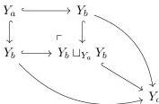

We examine the class of cofibrations. For a diagram $X \in \mathcal{M}^J$, the latching objects are $L_a X = \emptyset$, $L_b X = X_a \sqcup X_a$ and $L_c X = X_b \sqcup_{X_a} X_b$. These are cofibrant in $\mathcal{M}$. Then a map $f : X \to Y$ being a cofibration means that $X_a \hookrightarrow Y_a$,

$$X_b \sqcup_{X_a \sqcup X_a} (Y_a \sqcup Y_a) \hookrightarrow Y_b \text{ and } X_c \sqcup_{(X_b \sqcup_{X_a} X_b)} (Y_b \sqcup_{Y_a} Y_b) \hookrightarrow Y_c$$

are cofibrations in $\mathcal{M}$, and additionally $Y_a \sqcup_{X_a} X_c \xrightarrow{\sim} Y_c$ and $Y_b \sqcup_{X_b} X_c \xrightarrow{\sim} Y_c$ are trivial cofibrations in $\mathcal{M}$.

Therefore, a diagram $Y \in \mathcal{M}^J$ is *cofibrant* if $Y_a$ is a cofibrant object in $\mathcal{M}$,

$$Y_a \sqcup Y_a \hookrightarrow Y_b \text{ and } Y_b \sqcup_{Y_a} Y_b \hookrightarrow Y_c$$

are cofibrations, and additionally $Y_a \xrightarrow{\sim} Y_c$ and $Y_b \xrightarrow{\sim} Y_c$ are trivial cofibrations. Spelling out the second Reedy condition gives us the following commutative diagram:

This says that both maps $Y_a \xrightarrow[Y_j]{Y_i} Y_b$ are cofibrations. We can use this on the following diagram

to conclude that $Y_b \hookrightarrow Y_c$ is a cofibration. Of course this is in principle not necessary since we also have $Y_b \xrightarrow{\sim} Y_c$ is a trivial cofibration, but the novel aspect is that this follows only from Reedy cofibrancy. We also have a trivial cofibration $Y_a \xrightarrow{\sim} Y_c$, by the two-out-of-three property the maps $Y_a \xrightarrow[Y_j]{Y_i} Y_b$ are trivial cofibrations. We collect the above in the following:

70