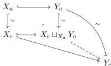
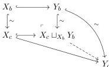

*Remark 4.23.* If $Y$ is cofibrant then we obtain the following diagram:

$$\begin{array}{ccc} Y_a \sqcup Y_a & \xrightarrow{\nabla} & Y_a \\ \downarrow & & \downarrow^\sim \\ Y_b & \xrightarrow{\sim} & Y_c. \end{array}$$

This is just to say that cofibrant diagrams of $\mathcal{M}_{Loc}^J$ encode objects of $\mathcal{M}$ for which a weak cylinder exists in the sense of theorem C.6.

We reiterate that our goal is to show that the category of diagrams $\mathcal{M}_{Loc}^J$ has a weak model structure on it, where the cofibrations are the ones as specified in theorem 4.19. We begin by showing the following lemmas which are expected results in the theory of right Bousfield localizations.

**Lemma 4.24.** *Let $X, Y \in \mathcal{M}_{Loc}^J$ cofibrant. Then, a map $X \to Y$ is a cofibration in $\mathcal{M}_{Loc}^J$ if and only if it is a cofibration in $\mathcal{M}_{Reedy}^J$.*

*Proof.* We only prove the interesting direction; assume that $X, Y$ are cofibrant in $\mathcal{M}_{Loc}^J$ and that $X \to Y \in \mathcal{M}_{Reedy}^J$ is a Reedy cofibration. Remains to show that

$$X_c \sqcup_{X_a} Y_a \to Y_c \text{ and } X_c \sqcup_{X_b} Y_b \to Y_c$$

are trivial cofibrations. The fact that the maps are weak equivalences follows by applying the 2-out-of-3 property to the diagrams:

The vertical maps $X_a \xrightarrow{\sim} X_c$, $X_b \xrightarrow{\sim} X_c$, $Y_a \xrightarrow{\sim} Y_c$ and $Y_b \xrightarrow{\sim} Y_c$, are trivial cofibrations since $X$ and $Y$ are cofibrant in $\mathcal{M}_{Loc}^J$. Remains to see that they are cofibrations. From the Reedy condition we have that the map $X_c \sqcup_{L_c X} L_c Y \hookrightarrow Y_c$ is a cofibration, and observe that the domains of the maps $X_c \sqcup_{X_a} Y_a \to Y_c$ and $X_c \sqcup_{X_b} Y_b \to Y_c$ are contained in the colimit $X_c \sqcup_{L_c X} L_c Y$. Therefore, the maps factor as composition of cofibrations

$$X_c \sqcup_{X_a} Y_a \hookrightarrow X_c \sqcup_{L_c X} L_c Y \hookrightarrow Y_c \text{ and } X_c \sqcup_{X_b} Y_b \hookrightarrow X_c \sqcup_{L_c X} L_c Y \hookrightarrow Y_c,$$

which concludes the proof.

71