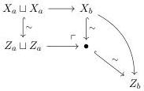
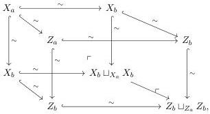

**Lemma 4.25.** Let $X \in \mathcal{M}_{Loc}^{J}$ cofibrant and $X \to Z \in \mathcal{M}_{Reedy}^{J}$ a Reedy trivial cofibration. Then $Z$ is cofibrant in $\mathcal{M}_{Loc}^{J}$. Furthermore, $X \to Z$ is a trivial cofibration in $\mathcal{M}_{Loc}^{J}$.

*Proof.* Since $X \xrightarrow{\sim} Z$ is a Reedy trivial cofibration, then $X_{a} \xrightarrow{\sim} Z_{a}$, $X_{b} \sqcup_{X_{a} \sqcup X_{a}} (Z_{a} \sqcup Z_{a}) \xrightarrow{\sim} Z_{b}$ and $X_{c} \sqcup_{(X_{b} \sqcup X_{a} X_{b})} (Z_{b} \sqcup_{Z_{a}} Z_{b}) \xrightarrow{\sim} Z_{c}$ are trivial cofibrations. We then obtain the following diagram:

This shows that $X_{b} \xrightarrow{\sim} Z_{b}$ is a trivial cofibration. Since $X$ is cofibrant then all the maps in the diagram

$$X_{a} \longrightarrow X_{b} \longrightarrow X_{c}$$

are trivial cofibrations. Consider the commutative diagram where the back and front faces are pushouts

which, by the two-out-of-three, shows that $X_{b} \sqcup_{X_{a}} X_{b} \xrightarrow{\sim} Z_{b} \sqcup_{Z_{a}} Z_{b}$ is a trivial cofibration. Remains to prove that $Z_{b} \xrightarrow{\sim} Z_{c}$ is a trivial cofibration.

72