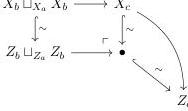
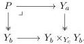

The pushout

shows that $X_c \xrightarrow{\sim} Z_c$ is a trivial cofibration. Note that $Z$ is Reedy cofibrant, hence $Z_b \hookrightarrow Z_c$ is a cofibration. By the two-out-of-three property, we can conclude that $Z_b \xrightarrow{\sim} Z_c$ is indeed a trivial cofibration. The above says that $Z$ is cofibrant.

The second part is also true, since $X \rightarrow Z$ is a level-wise weak equivalence. $\square$

**Corollary 4.26.** *Any map between diagrams $f: X \rightarrow Y$, where $X$ is a cofibrant diagram $X$ and $Y$ is a fibrant diagram in $\mathcal{M}_{Loc}^J$, can be factored as a trivial cofibration followed by a fibration.*

*Proof.* We factor $f: X \rightarrow Y$ in $\mathcal{M}_{Reedy}^J$ to obtain $X \xrightarrow{\sim} Z \rightarrow Y$. $Z \rightarrow Y$ is also a fibration in $\mathcal{M}_{Loc}^J$ as is it is level-wise. Finally, $X \xrightarrow{\sim} Z \in \mathcal{M}_{Loc}^J$ by the previous theorem 4.25. $\square$

For the factorization of a diagram map $f: X \rightarrow Y$ in $\mathcal{M}^J$, with $X$ cofibrant and $Y$ fibrant, into a cofibration followed by a trivial fibration we will need an auxiliary class of diagrams.

**Construction 4.27.** Denote by $K$ the category $J$ with the opposite Reedy structure given above (the degree function reversed). We endow $\mathcal{M}^K$ with the Reedy model structure. Then a diagram $Y \in \mathcal{M}_{Reedy}^K$ is fibrant if $Y_c \rightarrow 1$, $Y_b \rightarrow Y_c$ and $Y_a \rightarrow Y_b \times_{Y_c} Y_b$ are fibrations in $\mathcal{M}$. In this situation $Y_b$ is also fibrant.

The limit of a diagram $Y \in \mathcal{M}^K$ is simply the equalizer $Eq(Y_i, Y_j)$. Note that the following pullback also computes the limit of $Y$:

73