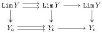
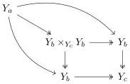
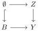
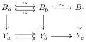

From this we conclude that $\operatorname{Lim} Y$ is a fibrant object of $\mathcal{M}$ if $Y \in \mathcal{M}_{Reedy}^K$ is fibrant, and letting $Z$ to denote the constant diagram at $\operatorname{Lim} Y$ then this comes with a diagram map $Z \to Y$ of the following form

where all top arrows are identities. Finally, note that $Y$ being fibrant in $\mathcal{M}_{Reedy}^K$ implies that both maps $Y_a \longrightarrow Y_b$ are fibrations. This can be deduced from the following diagram:

Observation 4.28. Recall that the fibrations in $\mathcal{M}_{Loc}^J$ are the level-wise fibrations. Since $Z \in \mathcal{M}^K$ is point-wise fibrant then it is Reedy fibrant in $\mathcal{M}_{Loc}^J$. Similarly, $Y$ is Reedy fibrant in $\mathcal{M}_{Reedy}^K$, in particular, implies that is object-wise fibrant, so it is fibrant in $\mathcal{M}_{Loc}^J$. We will use this diagram $Z$ throughout this section.

Lemma 4.29. The map $Z \to Y$ from above is a trivial fibration in $\mathcal{M}_{Loc}^J$.

Proof. We show that the map has the right lifting property against any cofibration $A \hookrightarrow B \in \mathcal{M}_{Loc}^J$. First, assume that $A = \emptyset$, and $B$ is a cofibrant object in $\mathcal{M}_{Loc}^J$ and $Y$ a fibrant diagram in $\mathcal{M}_{Reedy}^K$. We consider the lifting problem in $\mathcal{M}_{Loc}^J$:

From the discussion above we obtain the following commutative diagram:

74