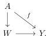
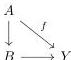
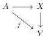
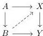

*Proof.* Since $Y$ is fibrant in $\mathcal{M}_{Reedy}^K$, then it is fibrant in $\mathcal{M}_{Loc}^J$ as these are level-wise fibrant. Similarly, $Z$ from theorem 4.27 is fibrant in $\mathcal{M}_{Loc}^J$, which also comes with a trivial fibration $Z \xrightarrow{\sim} Y$ by theorem 4.29. We can take a Reedy cofibrant replacement $W \xrightarrow{\sim} Z$. Since this last map is in particular a level-wise weak equivalence, it implies that the maps in $W$ are weak equivalences. By 2-out-of-3 property, the maps in $W$ are trivial cofibrations. This makes $W$ a cofibrant replacement in $\mathcal{M}^J$ of $Y$ by composing the trivial fibrations $W \xrightarrow{\sim} Z \xrightarrow{\sim} Y$. $\square$

Before giving the factorization, we need a technical result that follows from the next lemma.

*Remark 4.31.* From [Hen20, 2.1.11 Proposition], if $A \in \mathcal{M}$ is cofibrant then the coslice category $A/\mathcal{M}$ inherits a weak model structure from $\mathcal{M}$ where a map in $A/\mathcal{M}$ is cofibration, fibration and weak equivalences if it is one in $\mathcal{M}$. Dually, one induces a weak model structure on the slice $\mathcal{M}/Y$ if $Y$ is fibrant.

**Construction 4.32.** Consider a map $f : A \to Y$ in $\mathcal{M}$ where $A$ is cofibrant and $Y$ is fibrant. Consider $A/\mathcal{M}$ with the weak model structure described in the previous theorem 4.31.

The map $f : A \to Y$ allows us to see $Y$ as an object in $A/\mathcal{M}$, which is fibrant as $Y$ is fibrant in $\mathcal{M}$. So, we can take the slice $(A/\mathcal{M})/Y$. Objects of $(A/\mathcal{M})/Y$ are factorizations of the form

Let two objects in this category

and

which we refer to as $B$ and $X$. A map from $B$ to $X$ is a diagonal filler of the resulting commutative square:

76