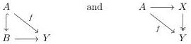
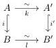
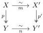

A cofibrant object in $(A/\mathcal{M})/Y$ is one in which the first map is a cofibration in $\mathcal{M}$, and a fibrant object when the last map is a fibration i.e.,

respectively. Also note that the category $(A/\mathcal{M})/Y$ coincides with $A/(\mathcal{M}/Y)$, both as categories and as model categories.

Observation 4.33. [Hen20, 2.4.3 Proposition] observed that the Quillen adjunction descends to the homotopy categories: If $F : \mathcal{C} \rightleftarrows \mathcal{D} : G$ is a Quillen pair, then we obtain a natural isomorphism

$$\mathrm{Ho}(\mathcal{C}^{\mathrm{BIF}})(W, G(Z)) \cong \mathrm{Ho}(\mathcal{D}^{\mathrm{BIF}})(F(W), Z)$$

of the homotopy categories.

The category $\mathrm{Ho}(\mathcal{C}^{\mathrm{BIF}})$ is the localization of the subcategory of bifibrant objects at trivial (co)fibrations. This is the content of [Hen20, 2.2.6 Theorem], which also proves that there are equivalences

$$\mathrm{Ho}(\mathcal{C}^{\mathrm{COF}}) \cong \mathrm{Ho}(\mathcal{C}^{\mathrm{BIF}}) \cong \mathrm{Ho}(\mathcal{C}^{\mathrm{FIB}})$$

where the first category is the localization of $\mathcal{C}^{\mathrm{COF}}$ at trivial cofibrations, and the second is the localization of $\mathcal{C}^{\mathrm{FIB}}$ at trivial fibrations. Therefore, up to these equivalences of categories, we say that $\mathrm{Ho}(F) : \mathrm{Ho}(\mathcal{C}^{\mathrm{COF}}) \to \mathrm{Ho}(\mathcal{D}^{\mathrm{COF}})$ and $\mathrm{Ho}(G) : \mathrm{Ho}(\mathcal{D}^{\mathrm{FIB}}) \to \mathrm{Ho}(\mathcal{C}^{\mathrm{FIB}})$ are "adjoint".

Lemma 4.34. For all $i : A \hookrightarrow B$ and $i' : A' \hookrightarrow B'$ cofibrations between cofibrant objects, for all $p : X \twoheadrightarrow Y$ fibration between fibrant objects, if there is a commutative diagram:

then $i \pitchfork p$ if and only if $i' \pitchfork p$. The dual statement also holds: For all $i : A \hookrightarrow B$ core cofibrations, for all $p : X \twoheadrightarrow Y$ and $p' : X' \twoheadrightarrow Y'$ fibrations between fibrant objects, if there is a commutative diagram:

77