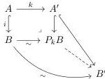

then $i \pitchfork p$ if and only if $i \pitchfork p'$.

*Proof.* We prove the first part of the lemma, the second part is dual. We have the following commutative squares

$$\begin{array}{ccc} A \xrightarrow[\sim]{k} A' & A \xrightarrow{f} X & A' \xrightarrow{f'} X \\ i \downarrow & i \downarrow & \downarrow p \\ B \xrightarrow[\sim]{l} B' & B \xrightarrow[g]{} Y & B' \xrightarrow[g]{} Y \end{array}$$

The proof relies heavily on theorem 4.32: The middle square above corresponds to a pair of objects $B, X$ in a double slice category $A/\mathcal{M}/Y$, and a diagonal filler witnessing that $i \pitchfork p$ is a map in this double slice category.

We start with the induced weak model structure on the slice $\mathcal{M}/Y$. Note that from [Hen20, 2.4.2 Example] the weak equivalence $k: A \rightarrow A'$ induces a weak Quillen equivalence $P_k: A/(\mathcal{M}/Y) \leftrightarrows A'/(\mathcal{M}/Y): U_k$. Observe that $B, B'$ are cofibrant and $Y$ is fibrant. In what follows we leave $Y$ implicit as we work in the slice $(A/\mathcal{M})/Y$, here we use that $(A/\mathcal{M})/Y = A/(\mathcal{M}/Y)$ from theorem 4.32.

The functor $P_k$ takes a cofibration $A \hookrightarrow C$ along $k: A \rightarrow A'$, while $U_k$ precomposes with $k$. Using the following diagram, since $P_k B$ is cofibrant, by the 2-out-of-3 property

we see that there is a weak equivalence $P_k B \xrightarrow{\sim} B'$, this implies they are isomorphic in $\mathrm{Ho}(A'/(\mathcal{M}/Y))$. We have:

$$\begin{aligned} \mathrm{Hom}_{\mathrm{Ho}(A'/(\mathcal{M}/Y))}(B', X) &\cong \mathrm{Hom}_{\mathrm{Ho}(A'/(\mathcal{M}/Y))}(P_k(B), X) \\ &\cong \mathrm{Hom}_{\mathrm{Ho}(A/(\mathcal{M}/Y))}(B, U_k(X)) \\ &\cong \mathrm{Hom}_{\mathrm{Ho}(A/(\mathcal{M}/Y))}(B, X). \end{aligned}$$

The first isomorphism follows from $B' \cong P_k(B)$ in $\mathrm{Ho}(A'/(\mathcal{M}/Y))$, the second is the weak Quillen adjunction $P_k \dashv U_k$ applied to the cofibrant object $B \in (A/\mathcal{M})/Y$ and the fibrant object $X \in (A'/\mathcal{M})/Y$. We crucially

78