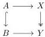
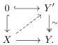
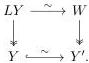

use theorem 4.33, so the second isomorphism is really up to some equivalence of categories.

Now we use $\mathrm{Hom}_{\mathrm{Ho}(A' / (\mathcal{M} / Y))}(B', X) \cong \mathrm{Hom}_{\mathrm{Ho}(A / (\mathcal{M} / Y))}(B, X)$ to conclude. First, recall that a diagonal filler of

is the same as a map $B \to X$ in $A / \mathcal{M} / Y$, and similarly for $B'$ and $X$. Assume that $i \pitchfork p$, this give us a map $B \to X$ in $\mathrm{Ho}(A / \mathcal{M} / Y)$. Using the isomorphism, we have a map $B' \to X$ in $\mathrm{Ho}(A' / \mathcal{M} / Y)$, from which we can select a representative of the homotopy class, which implies that $i' \pitchfork p$. Similarly, we get that $i' \pitchfork p$ implies $i \pitchfork p$. $\square$

**Lemma 4.35.** *Let $X \to Y$ be a map in $\mathcal{M}^J$ with $X$ cofibrant and $Y$ fibrant. Then such a map can be factored as a cofibration followed by a trivial fibration.*

*Proof.* Observe first that $Y$ can be assumed to be Reedy cofibrant in $\mathcal{M}^J$. Indeed, we can simply take a Reedy cofibrant replacement $Y' \xrightarrow{\sim} Y$, and instead use the dashed arrow

Under this assumption, $Y$ is point-wise cofibrant, whence Reedy cofibrant in $\mathcal{M}^K$. Therefore, we can take a fibrant replacement in $\mathcal{M}^K$, $Y \xrightarrow{\sim} Y'$. Using [Hen20, Corollary 2.4.4] equivalences are preserved under pullbacks along fibrations, so we get the pullback square

Furthermore, we know from theorem 4.30 that $W \twoheadrightarrow Y'$ is a trivial fibration in $\mathcal{M}^J$. Therefore, it has the right lifting property against any cofibration between cofibrant objects in $\mathcal{M}^J$. We can use theorem 4.34 to conclude

79