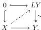

that $LY \rightarrow Y$ satisfies the same property, *i.e.*, it is a trivial fibration in $\mathcal{M}^J$. Since $X$ is cofibrant, we obtain a lift

The map $X \rightarrow LY$ can be factored in the Reedy model structure $\mathcal{M}^J$ as $X \hookrightarrow X' \xrightarrow{\sim} LY$. The diagram $X'$ is cofibrant in $\mathcal{M}^J$ since it is equivalent to the cofibrant diagram $LY$, and $X$ is cofibrant by assumption. Therefore, it follows from theorem 4.25 that the Reedy cofibration $X \hookrightarrow X'$ is a cofibration in the model $\mathcal{M}^J$. This gives us the desired factorization in $\mathcal{M}^J$, $X \hookrightarrow X' \xrightarrow{\sim} Y$. $\square$

All the previous work can be summarized in the following proof of theorem 4.19. This proves that the category of diagrams $\mathcal{M}^J$ has a weak model structure with the specified cofibrations and fibrations, which, as explained above, encodes objects with a weak cylinder object. We remark that our proof will show that the conditions of [Hen20, 2.1.10 Definition] are satisfied instead of theorem C.1. The reason is for this is that in theorem 4.19 we do not have an explicit class of weak equivalences. More precisely, we will use [Hen20, 2.3.3 Proposition] which gives some alternative criteria to obtain a weak model structure in this sense.

*Proof.* (theorem 4.19) Note first that we have the Reedy weak model structure on $\mathcal{M}^J$ by virtue of theorem C.11. Also, the existence of initial and terminal diagrams is clear. We must justify that the class of (co)fibrations form a class of (co)fibrations in $\mathcal{M}^J$. For fibrations, since these are level-wise, it is immediate that: the terminal diagram is fibrant, any isomorphism with fibrant codomain is a fibration, the class is closed under compositions, and stable under pullbacks along maps between fibrant objects.

The dual conditions must be verified for the class of cofibrations. That the initial diagram is cofibrant it is immediate to verify. To see other stability conditions, we observe these are true for $\mathcal{M}^J_{Reedy}$. In addition, for stability under isomorphisms we use repeatedly that maps in $\mathcal{M}$ isomorphic to trivial cofibration are also trivial cofibrations. This simply because the new condition we added involves the requirement that certain maps trivial cofibrations. Stability under pushouts follows from the stability in $\mathcal{M}^J_{Reedy}$ and the fact that trivial cofibrations in the weak model $\mathcal{M}$ are pushout stable.

80