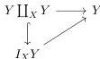

The factorization of a map $f : X \to Y$, where $X$ is cofibrant and $Y$ is fibrant, into a cofibration followed by a trivial fibration is the content of theorem 4.35.

The factorization of a map $f : X \to Y$, where $X$ is cofibrant and $Y$ is fibrant, into a trivial cofibration followed by a fibration is guaranteed by theorem 4.26.

In order to conclude, we use [Hen20, 2.3.3 Proposition]. For which we need to verify that a cofibration $X \to Y \in \mathcal{M}_{Loc}^J$ with $X$ cofibrant and $Y$ fibrant admit a relative strong cylinder object. Firstly, we know that the map admits a relative cylinder object in $\mathcal{M}_{Reedy}^J$:

with $Y \hookrightarrow Y \coprod_X Y \hookrightarrow I_X Y$ a Reedy trivial cofibration. Since $Y$ is cofibrant in $\mathcal{M}_{Loc}^J$ we can use theorem 4.25 to conclude that $I_X Y$ is also cofibrant in $\mathcal{M}_{Loc}^J$, and that the map $Y \to I_X Y$ is a trivial cofibration in $\mathcal{M}_{Loc}^J$. Now we have cofibrant objects $Y \coprod_X Y$, $I_X Y$ in $\mathcal{M}_{Loc}^J$ and a Reedy cofibration between them, so we use theorem 4.24 to conclude it is actually a cofibration in $\mathcal{M}_{Loc}^J$. This gives us the relative cylinder objects.

Finally, the 2-out-of-3 property for trivial cofibrations between bifibrant objects follows using that $\mathcal{M}_{Reedy}^J$ is a weak model category, so the property is true in this Reedy weak model structure. By which we mean that the property is true for the underlying Reedy trivial cofibrations between bifibrant objects of $\mathcal{M}_{Loc}^J$. Theorem 4.25 allows us to conclude that such Reedy trivial cofibrations are indeed trivial cofibrations in $\mathcal{M}_{Loc}^J$. Now [Hen20, 2.3.3 Proposition] allows us to conclude that $\mathcal{M}_{Loc}^J$, with the specified classes of maps, is a weak model category. $\square$

### 4.3.2 Weak model on correspondences

Next, we consider another diagram category $I$:

$$0 \to 2 \leftarrow 1$$

Where $\deg(0) = \deg(1) = 0$ and $\deg(2) = 1$. Similarly to the previous section, we construct a “right Bousfield localization” of the Reedy weak model structure on $\mathcal{N}^I$.

81