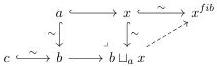
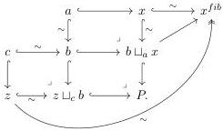
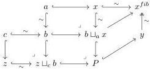

### 4.3.3 Projections are Barton trivial fibrations

**Lemma 4.45.** *The functor $\mathcal{N}^I \to \mathcal{N}$ such that $A \to B \leftarrow C \in \mathcal{N}^I \mapsto A \in \mathcal{N}$, is extensible. Also, the functor $\mathcal{N}^I \to \mathcal{N}$ such that $A \to B \leftarrow C \in \mathcal{N}^I \mapsto C \in \mathcal{N}$ is extensible.*

*Proof.* Let $A := a \xrightarrow{\sim} b \xleftarrow{\sim} c \in \mathcal{N}^I_{Loc}$ be a cofibrant diagram and $x \in \mathcal{N}^{\mathrm{COF}}$ a cofibrant object and a cofibration $a \hookrightarrow x$. We take the fibrant replacement of $x$ and consider the pushout as indicated below, and we obtain a solution to the lifting problem on the right:

The resulting map $c \to x^{fib}$ can be factored as $c \hookrightarrow z \xrightarrow{\sim} x^{fib}$. We can take further pushouts

There is a map $P \to x^{fib}$ which we can factor as $P \hookrightarrow y \xrightarrow{\sim} x^{fib}$, and the resulting diagram we get

Furthermore, there is a map $b \sqcup_a x \to y$ which is a cofibration as it is the composite of the two cofibrations. Using the 2-out-of-3 property repeatedly,

84