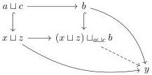
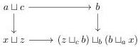
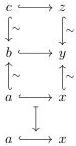

one concludes that the map $z \sqcup_c b \to y$ is a trivial cofibration. Thus, we have constructed the cofibrant object $X := z \xrightarrow{\sim} y \xleftarrow{\sim} x \in \mathcal{N}_{Loc}^I$. The induced map $A \to X$ is a level-wise cofibration. The maps $b \sqcup_a x \to y$ and $b \sqcup_a z \to y$ are trivial cofibrations.

Remains to show that $A \to X$ is a Reedy cofibration. We already have that $a \to x$ and $c \to z$ are cofibrations. We now need to show that the induced map

is a cofibration. By diagram chasing, one can show that the diagram

commutes. One shows that the bottom right corner computes the pushout of the span. Using that the map $P \hookrightarrow y$ is a cofibration one concludes that $(x \sqcup) \sqcup_{a \sqcup c} b \to y$ is also a cofibration. This concludes the proof that $A \to X$ is a Reedy core cofibration in $\mathcal{N}^I$. Therefore, it must a cofibration. We summarize our construction with the following diagram:

This cofibration is a (strict) lift of $a \hookrightarrow x$, showing that the functor $\mathcal{N}^I \to N$ is an extensible functor. The second part of the lemma is analogous. $\square$

85