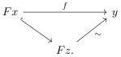

Observation 4.46. Note that in the previous theorem 4.45, using 2-out-of-3 property, if we start with a trivial cofibration $a \stackrel{\sim}{\hookrightarrow} x$ then we obtain a level-wise equivalence between cofibrant objects in $\mathcal{N}_{Loc}^{I}$. We conclude that the projections are weakly conservative.

Corollary 4.47. The functor $\mathcal{N}^{I} \to \mathcal{N}$ such that $A \to B \leftarrow C \in \mathcal{N}^{I} \mapsto A \in \mathcal{N}$, is a Barton trivial fibration. Also, the functor $\mathcal{N}^{I} \to \mathcal{N}$ such that $A \to B \leftarrow C \in \mathcal{N}^{I} \mapsto C \in \mathcal{N}$, is a Barton trivial fibration.

Proof. We saw in theorem 4.45 that the projections are extensible and from theorem 4.46 that is weakly conservative. It is also straightforward to see that it preserve cofibrations and trivial cofibrations. □

We now want to see that any left Quillen functor $F : \mathcal{M} \to \mathcal{N}$ part of a Quillen equivalence between weak model categories admits a Brown-like factorization. To this end, consider the following:

Construction 4.48. We define the category of diagrams

$$\mathcal{N}_{F}^{I} := \{Fa \to b \leftarrow c | a \in \mathcal{M}^{\mathrm{COF}}, b, c \in \mathcal{N}\}.$$

The weak model structure on this category is similar to that of $\mathcal{N}^{I}$, the only difference is that $X \to Y$ is a cofibration if $X_{b} \sqcup_{FX_{a}} FY_{a} \to Y_{b}$ is a trivial cofibration.

When $F$ is the identity functor we recover $\mathcal{N}^{I}$ from theorem 4.36. A cofibrant object in $\mathcal{N}_{F}^{I}$ is a diagram of the form

$$Fa \stackrel{\sim}{\hookrightarrow} b \stackrel{\sim}{\longleftarrow} c.$$

Observation 4.49. With the set up above, it follows from theorem 4.47 that the projection $\pi_{1} : \mathcal{N}_{F}^{I} \to \mathcal{M}$, sending each diagram $Fa \to b \leftarrow c$ to $a$, is a Barton trivial fibration.

To show that the projection from $\pi_{2} : \mathcal{N}_{F}^{I} \to \mathcal{N}$ sending each diagram $Fa \to b \leftarrow c$ to $c \in \mathcal{N}$ is a trivial fibration we make use of the following:

Lemma 4.50. Let $F : \mathcal{M} \to \mathcal{N}$ be a left Quillen equivalence between weak model categories. For any objects $x \in \mathcal{M}^{\mathrm{COF}}$, $y \in \mathcal{N}^{\mathrm{FIB}}$ and a map $f : Fx \to y$ there exists an object $z \in \mathcal{M}^{\mathrm{COF}}$ such that $f$ factors as

86