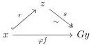
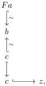

Proof. We know that there is an isomorphism

$$\varphi : \operatorname{Hom}_{\mathcal{N}}(Fx, y) \simeq \operatorname{Hom}_{\mathcal{M}}(x, Gy) : \varphi^{-1}$$

given by the Quillen adjunction, natural in $x \in \mathcal{M}^{\mathrm{COF}}$ and $y \in \mathcal{N}^{\mathrm{FIB}}$. Recall from [Hen20, 2.4.3 Proposition] that $F : \mathcal{M}^{\mathrm{COF}} \to \mathcal{N}^{\mathrm{COF}}$ and $G : \mathcal{N}^{\mathrm{FIB}} \to \mathcal{M}^{\mathrm{FIB}}$ preserve equivalences. Take $\varphi f$ the adjoint transpose of $f$. We can take a factorization

By naturality, one checks that $f = \varphi^{-1}sFr$ where $Fr$ is a cofibration. Since the Quillen pair is an equivalence, we deduce from [Hen20, 2.4.5 Proposition (i)] that $\varphi^{-1}s$ is an equivalence. □

Corollary 4.51. Let $F : \mathcal{M} \rightleftarrows \mathcal{N} : G$ be a Quillen equivalence. Then the projection $\pi_2 : \mathcal{N}_F^I \to \mathcal{N}$ sending each diagram $Fa \to b \leftarrow c$ to $c \in \mathcal{N}$ is a Barton trivial fibration.

Proof. We show that in a situation as in the diagram

there is a cofibrant object over $z$ that projects onto $c \hookrightarrow z$. By taking a fibrant replacement, we can assume that the diagram is point-wise fibrant. From [Hen20, 2.2.3 Proposition] there exists a homotopy inverse of $c \xrightarrow{\sim} b$, this give us a map $Fa \to c$. Using theorem 4.50 this last map can be factored as $Fa \hookrightarrow Fx \xrightarrow{\sim} c$. The rest of the proof continues as in theorem 4.47. □

87