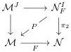

Proof. Recall from theorem 4.8 that for any cofibrant object $A$ the induced map $h\mathbb{L}F_A$ is injective. Remains to show that it is surjective. Using theorem 4.53, we obtain a diagram

where $P$ is a Barton trivial fibration. $P : \mathcal{N}_F^I \to \mathcal{M}$ induces, for any cofibrant object $X \in \mathcal{N}_F^I$, an isomorphism $(h\mathbb{L}\pi_1)_X : h\mathbb{L}_{\lambda}^{\mathcal{N}_F^I}(X) \to h\mathbb{L}_{\lambda}^{\mathcal{M}}(\pi_1 X)$. Indeed, this follows from theorem 4.16. Similarly, the map $(h\mathbb{L}\pi_2)_X : h\mathbb{L}_{\lambda}^{\mathcal{N}_F^I}(X) \to h\mathbb{L}_{\lambda}^{\mathcal{N}}(\pi_2 X)$ is an isomorphism of $\lambda$-boolean algebras. For $A \in \mathcal{M}^{\mathrm{COF}}$ cofibrant we can get a correspondence in $C_{FA} \in \mathcal{N}_F^I$ with all objects $FA$ and maps the identities. We can conclude that $h\mathbb{L}F_A$ is surjective by chasing through the maps $(h\mathbb{L}\pi_2)_{C_A}$ and $(h\mathbb{L}P)_{C_A}$ which we already know are isomorphisms.

It is an immediate that:

Corollary 4.55. For any Quillen equivalence $F : \mathcal{M} \rightleftarrows \mathcal{N} : G$. The functors $Ho(F) \circ h\mathbb{L}_{\lambda}^{\mathcal{M}}$ and $h\mathbb{L}_{\lambda}^{\mathcal{N}} : Ho(\mathcal{N}) \to \mathbf{Bool}_{\lambda}$ are naturally isomorphic via $h\mathbb{L}F$.

### A Infinitary Cartmell theories

We introduce a generalization of Cartmell theories, also known as generalized algebraic theories, Cartmell [Car78]. This is straightforward and most of the proofs will be omitted since they are similar to those in [Car78]. In very few cases we will need to provide new proofs. We claim no originality other than the generalization itself. We begin by recalling some definitions given in Ibid. We assume to have a set of variables $V$ whose size is $\aleph_0$ and an alphabet $A$. Informally, a Cartmell generalized algebraic theory consists of:

i) A set \(S\), called the set of sort symbols,
ii) A set \(O\), called the set of operation symbols,
iii) An introductory rule for each sort symbol,
iv) An introductory rule for each operation symbol,

89