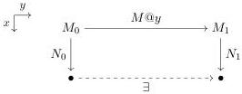

5:12

E. CAVALLO AND R. HARPER

Vol. 17:4

that $\mathsf{coe}_{x.A}^{1\rightharpoonup 0}(-)$ is inverse to $\mathsf{coe}_{x.A}^{0\rightharpoonup 1}(-)$ up to a path.

$$\frac{M \in A[0/x]}{\lambda^{\mathbb{I}} y.\mathsf{coe}_{x.A}^{y\rightharpoonup 0}(\mathsf{coe}_{x.A}^{0\rightharpoonup y}(M)) \in \mathsf{Path}_{A[0/x]}(M, \mathsf{coe}_{x.A}^{1\rightharpoonup 0}(\mathsf{coe}_{x.A}^{0\rightharpoonup 1}(M)))}$$

Operationally, coercion evaluates by cases on the shape of the type path $x.A$. For example, the following equation describes the behavior of coercion at a product type $x.(a:A) \times B$.

$$\frac{x:\mathbb{I}\gg A\text{ type}\quad x:\mathbb{I},a:A\gg B\text{ type}\quad M\in((a:A)\times B)[r/x]}{\mathsf{coe}_{x.(a:A)\times B}^{r\rightharpoonup s}(M)=\langle\mathsf{coe}_{x.A}^{r\rightharpoonup s}(\mathsf{fst}(M)),\mathsf{coe}_{x.B[\mathsf{coe}_{x.A}^{r\rightharpoonup s}(\mathsf{fst}(M))/a]}^{r\rightharpoonup s}(\mathsf{snd}(M))\rangle\in((a:A)\times B)[s/x]}$$

Homogeneous composition (which we will often just call composition) serves a more technical purpose: to evaluate coercions along lines of the form $x.\mathsf{Path}_{y.A}(N_0,N_1)$. For the moment, let us assume that $A$ does not depend on $x$. In order to execute such a coercion, we must be able to adjust the endpoints of a given path by another pair of paths. That is, given $M\in\mathsf{Path}_{y.A}(M_0,M_1)$ and lines $x.N_0$, $x.N_1$ fitting into the following shape, we should be able to produce a new, “adjusted” path shown as a dashed line below.

Homogeneous composition, written hcom, is a generalized form of this operation that adjusts the boundary of a term, a boundary being specified by a sequence of constraints on interval variables. As an example, the adjusted path above is obtained as the following composite.

$$y:\mathbb{I}\gg\mathsf{hcom}_{A}^{0\rightharpoonup 1}(M\@y;y=0\hookrightarrow x.N_{0},y=1\hookrightarrow x.N_{1})\in A$$

The general operator has the form $\mathsf{hcom}_{A}^{r\rightharpoonup s}(M;\overline{\xi_{i}\hookrightarrow x.N_{i}})$; it is characterized by the second rule of Figure 2. We use the notation $\overline{\xi_{i}\hookrightarrow x.N_{i}}$ to denote a finite list of constraint-line pairs $\xi_{1}\hookrightarrow x.N_{1},\ldots,\xi_{n}\hookrightarrow x.N_{n}$, implicitly quantifying over an indexing variable $i$. Like coercion, we define homogeneous composition by case analysis of the type argument. Where the special case involving a pair of constraints $y=0$ and $y=1$ on a single interval variable is enough for coercion in the path type, the general form becomes necessary to implement composition in the path type; the general form thus represents a “strengthened induction hypothesis”.

To handle coercion along $x.\mathsf{Path}_{y.A}(N_0,N_1)$ when $A$ does depend on $x$, we can combine coercion and composition into a unified heterogeneous composition operator, com, which coerces an input across a type line while simultaneously adjusting by a boundary path along that line. Defined as follows, com satisfies the third rule shown in Figure 2.

$$\mathsf{com}_{x.A}^{r\rightharpoonup s}(M;\overline{\xi_{i}\hookrightarrow x.N_{i}}):=\mathsf{hcom}_{A[s/x]}^{r\rightharpoonup s}(\mathsf{coe}_{x.A}^{r\rightharpoonup s}(M);\overline{\xi_{i}\hookrightarrow x.\mathsf{coe}_{x.A}^{x\rightharpoonup s}(N_{i})})$$

Both hcom and coe can be recovered from com, so the latter is may be taken as primitive instead, as in [CCHM15, AFH18]. Either way, the ability to decompose com into hcom and coe plays a key role in defining Kan operations for higher inductive types [CHM18, CH19a].