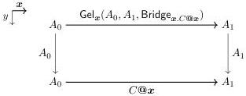

5:22

E. CAVALLO AND R. HARPER

Vol. 17:4

Let $C : \text{Bridge}_{\mathcal{U}}(A_0, A_1)$ be given. We are asked to provide a square with the following boundary.

By “flipping” this square—i.e., using the correspondence between bridges of paths and paths of bridges given by exchange of variables—it suffices to show the following.

$$\text{Bridge}_{\boldsymbol{x}, \text{Path}_{\mathcal{U}}(\text{Gel}_{\boldsymbol{x}}(A_0, A_1, \text{Bridge}_{\boldsymbol{x}, C@\boldsymbol{x}}), C@\boldsymbol{x})}(\lambda^{\mathbb{I}} \_\!\!\!_- A_0, \lambda^{\mathbb{I}} \_\!\!\!_- A_1)$$

Now we apply univalence, converting the path type in the universe to a type of isomorphisms. Here we use the fact that the constant paths $\lambda^{\mathbb{I}} \_\!\!\!_- A_\varepsilon$ correspond to identity isomorphisms $\text{idiso}(A_\varepsilon)$ across univalence. This reduces our goal to the following.

$$\text{Bridge}_{\boldsymbol{x}, \text{Gel}_{\boldsymbol{x}}(A_0, A_1, \text{Bridge}_{\boldsymbol{x}, C@\boldsymbol{x}}) \simeq C@\boldsymbol{x}}(\text{idiso}(A_0), \text{idiso}(A_1))$$

Finally we apply Proposition 2.3, reducing the goal once more.

$$(a_0: A_0)(a_1: A_1) \to \text{Bridge}_{\text{Gel}_{\boldsymbol{x}}(A_0, A_1, \text{Bridge}_{\boldsymbol{x}, C@\boldsymbol{x}})}(a_0, a_1) \simeq \text{Bridge}_{\boldsymbol{x}, C@\boldsymbol{x}}(a_0, a_1)$$

This is a consequence of the left inverse condition we have already proven.

Note that the proof of relativity relies on univalence; not surprising, since it is an isomorphism between types that involve the universe. (It also relies directly on function extensionality, both for paths and bridges.) In [BCM15], which does not include univalence, relativity is instead ensured by imposing stronger equations on Gel-types—precisely the equations $\text{Bridge}_{\boldsymbol{x}, \text{Gel}_{\boldsymbol{x}}(A_0, A_1, R)} = R$ and $C = \lambda^{\mathbb{I}} \boldsymbol{x} \cdot \text{Gel}_{\boldsymbol{x}}(A_0, A_1, \text{Bridge}_{\boldsymbol{x}, C@\boldsymbol{x}})$ required for the proof. (These equations are there named PAIR-PRED and SURJ-TYP.) These equations make it more difficult to construct a presheaf model, as we discuss further in Section 6.

2.5. Using affine variables for paths. Before we dive into using parametric cubical type theory, let us take one more moment to reflect on structural and substructural interval variables. We have seen why affinity is important for parametric type theory, but is structurality important for cubical type theory? The Bezem-Coquand-Huber model gives a partial negative answer: there is a model of univalent type theory in presheaves on the affine cube category [BCH13, BCH19]. While no one has attempted to design a type theory based on this model, it is plausible that it could be done.

Unfortunately, affine interval variables create problems for modeling higher inductive types. Consider, for example, the following extremely simple type, which has a single path constructor with no fixed boundary.

data line where

$$| \text{in}(x : \mathbb{I}) \in \text{line}$$