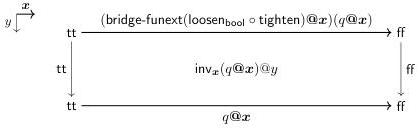

Vol. 17:4

INTERNAL PARAMETRICITY FOR CUBICAL TYPE THEORY

5:27

We make use of the type $\text{Gel}_x(\text{bool}, \text{bool}, \text{Path}_{\text{bool}})$, the bridge from bool to bool corresponding to the path relation. This type has two canonical elements given by reflexivity at tt and ff.

$$\text{tt}_x := \text{gel}_x(\text{tt}, \text{tt}, \lambda^{\mathbb{I}}...\text{tt}) \quad \text{ff}_x := \text{gel}_x(\text{ff}, \text{ff}, \lambda^{\mathbb{I}}...\text{ff})$$

Given $x : \mathbf{I}$, we define an auxiliary function $\text{tighten}_x \in \text{bool} \to \text{Gel}_x(\text{bool}, \text{bool}, \text{Path}_{\text{bool}})$ sending each $b : \text{bool}$ to the corresponding such element.

$$\text{tighten}_x := \lambda b. \text{if}_{-\text{Gel}_x(\text{bool}, \text{bool}, \text{Path}_{\text{bool}})}(b; \text{tt}_x, \text{ff}_x)$$

We then define $\text{tighten} := \lambda q. \text{ungel}(x. \text{tighten}_x(q@x))$, applying $\text{tighten}_x$ pointwise to the input bridge.

To equate $\text{loosen}_{\text{bool}}(\text{tighten}(q))$ with $q$, we need a term as follows.

$$\text{inv} \in (q: \text{Bridge}_{\text{bool}}(\text{tt}, \text{ff})) \to \text{Path}_{\text{Bridge}_{\text{bool}}(\text{tt}, \text{ff})}(\text{loosen}_{\text{bool}}(\text{tighten}(q)), q)$$

We again begin by defining an auxiliary function $\text{inv}_x$ of the following type.

$$\text{inv}_x \in (b: \text{bool}) \to \text{Path}_{\text{bool}}((\text{bridge-funext}(\text{loosen}_{\text{bool}} \circ \text{tighten})@x)(b), b)$$

We define $\text{inv}_x(b)$ by induction on $b$. When $b$ is $\text{tt}$, we have the following chain of equalities.

$$\begin{aligned} (\text{bridge-funext}(\text{loosen}_{\text{bool}} \circ \text{tighten})@x)(\text{tt}) &= \text{loosen}_{\text{bool}}(\text{ungel}(x. \text{tighten}_x(\text{tt})))@x \\ &= \text{loosen}_{\text{bool}}(\text{ungel}(x. \text{tt}_x))@x \\ &= \text{loosen}_{\text{bool}}(\lambda^{\mathbb{I}}...\text{tt})@x \end{aligned}$$

The first equation is $\text{EXTENT-}\beta$, the second is by definition of $\text{tighten}_x$, and the third is $\text{GEL-}\beta$. Finally, $\text{loosen}_{\text{bool}}(\lambda^{\mathbb{I}}...\text{tt})@x$ is path-equal to $\text{tt}$ by Remark 3.3. The $\text{ff}$ case follows by the same argument. Note that both $\text{inv}_\varepsilon(\text{tt}) \in \text{Path}_{\text{bool}}(\text{tt}, \text{tt})$ and $\text{inv}_\varepsilon(\text{ff}) \in \text{Path}_{\text{bool}}(\text{ff}, \text{ff})$ are reflexive paths for $\varepsilon \in \{0, 1\}$.

Given $q : \text{Path}_{\text{bool}}(\text{tt}, \text{ff})$, we see that the pointwise application $\text{inv}_x(q@x)@y$ fills the following square.

By $\text{EXTENT-}\beta$, the top of this square is equal to $\text{loosen}_{\text{bool}}(\text{tighten}(q))@x$. We may therefore define $\text{inv} := \lambda q. \lambda^{\mathbb{I}} y. \lambda^{\mathbf{I}} x. \text{inv}_x(q@x)@y$.

The pattern of argument we used for bool generalizes to characterize the bridge types of other inductive types, and in particular to show that inductive types preserve bridge-discreteness. (We will see something like it again in Section 3.4.) The fact that relativity is used (via Gel-types) in these proofs is an interesting parallel to the use of univalence to characterize the path types of higher inductive types (e.g., [Uni13, §8.1]).

The bridge-discrete types are even closed under Gel-types, which means that we can also carry out parametricity arguments in $\mathcal{U}_{\text{BDisc}}$. For example, we can show that the Church encoding $(A: \mathcal{U}_{\text{BDisc}}) \to \text{fst}(A) \to \text{fst}(A) \to \text{fst}(A)$ is also isomorphic to bool.