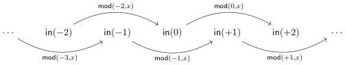

Vol. 17:4

INTERNAL PARAMETRICITY FOR CUBICAL TYPE THEORY

5:3

The first constructor of this type is standard: whenever we have an integer $n : \mathbb{Z}$, we get $\mathfrak{in}(n) \in \mathbb{Z}/2\mathbb{Z}$. The second is a path constructor: whenever we have $n : \mathbb{Z}$, we get a path from $\mathfrak{in}(n)$ to $\mathfrak{in}(n + 2)$. That path is represented by a term $\mathsf{mod}(n, x)$ depending on an interval variable $x$, together with equations declaring that $\mathsf{mod}(n, 0)$ is $\mathfrak{in}(n)$ and $\mathsf{mod}(n, 1)$ is $\mathfrak{in}(n + 2)$. The interval is to be thought of roughly as the real interval from analysis: as $x : \mathbb{I}$ varies from 0 to 1, the constructor $\mathsf{mod}(n, x)$ draws a line from $\mathfrak{in}(n)$ to $\mathfrak{in}(n + 2)$. Pictorially, we have something like the following.

To construct a map from $\mathbb{Z}/2\mathbb{Z}$ to another type, we simply explain where to send $\mathfrak{in}(n)$ and $\mathsf{mod}(n, x)$, just as in ordinary induction. For example, the increment map $\mathfrak{inc} \in \mathbb{Z}/2\mathbb{Z} \to \mathbb{Z}/2\mathbb{Z}$ is defined by the clauses $\mathfrak{inc}(\mathfrak{in}(n)) := \mathfrak{in}(n + 1)$ and $\mathfrak{inc}(\mathsf{mod}(n, x)) := \mathsf{mod}(n + 1, x)$. In order for the definition to be sensible, we need to check that $\mathfrak{inc}(\mathsf{mod}(n, 0)) = \mathfrak{inc}(\mathfrak{in}(n))$ and $\mathfrak{inc}(\mathsf{mod}(n, 1)) = \mathfrak{inc}(\mathfrak{in}(n + 2))$. Similarly, we can define addition by an iterated induction of the following form.

$$\begin{array}{l} \mathfrak{in}(m) \quad + \quad \mathfrak{in}(n) \quad := \quad \mathfrak{in}(m + n) \\ \mathsf{mod}(m, x) \quad + \quad \mathfrak{in}(n) \quad := \quad \cdots \\ \mathfrak{in}(m) \quad + \quad \mathsf{mod}(n, y) \quad := \quad \cdots \\ \mathsf{mod}(m, x) \quad + \quad \mathsf{mod}(n, y) \quad := \quad \cdots \end{array}$$

The final clause of this definition depends on two interval variables $x, y : \mathbb{I}$. We can visualize it as a square with a boundary determined by the other clauses.

$$y \overset{x}{\longmapsto} \mathfrak{in}(m) + \mathsf{mod}(n, y) \overset{\bullet}{\longmapsto} \mathsf{mod}(m, x) + \mathfrak{in}(n) \overset{\bullet}{\longmapsto} \mathsf{ind}(m + 2) + \mathsf{mod}(n, y)$$

Finding a term to fill this square is not so simple, particularly if the edge clauses are already defined in a complicated way.

Iterated induction on higher inductive types is a frequent source of such coherence obligations. Particularly notorious instances, which will serve as a test case in this paper, are proofs establishing the algebraic structure of the smash product [Uni13, §6.8]. The smash product $\wedge_*$ is a binary operator on pointed types, pairs $A_* = \langle A, a_0 \rangle$ of types $A$ equipped with a chosen "basepoint" element $a_0 \in A$. We will define the product in Section 3.4; for now, it suffices to know that we define its underlying type as a higher inductive type. The smash product is a natural notion of tensor product for the category of pointed types. In particular, suppose we write $A_* \to B_*$ for the type of basepoint-preserving functions between pointed types $A_*$ and $B_*$, which we can make into a pointed type $A_* \to_* B_*$ by taking the unique basepoint-preserving constant function as its basepoint. Then we have a (pointed) isomorphism $A_* \to_* (B_* \to_* C_*) \simeq (A_* \wedge_* B_*) \to_* C_*$. The smash product appears as a