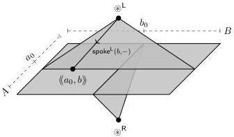
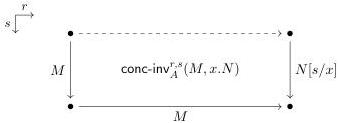
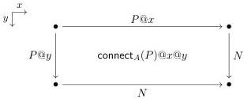

5:30

E. CAVALLO AND R. HARPER

Vol. 17:4

Figure 7: The smash product of $\langle A, a_0 \rangle$ and $\langle B, b_0 \rangle$

We prove a graph lemma (Lemma 3.25) that relates the smash product of $\mathbf{Gr}^s$-types with the action of the smash product on their underlying functions. First, the following two technical definitions will be handy for concisely filling coherence conditions.

Definition 3.22 (Concatenation by inverse). Let $M \in A$, $r \in \mathbb{I}$, and $x : \mathbb{I} \gg N \in A$ with $r = 1 \gg M = N[1/x] \in A$ be given. For any $s \in \mathbb{I}$, define $\text{conc-inv}_A^{r,s}(M, x.N) \in A$ as follows.

$$\text{conc-inv}_A^{r,s}(M, x.N) := \text{hcom}_A^{1 \rightsquigarrow s}(M; r = 0 \hookrightarrow \_M, r = 1 \hookrightarrow x.N)$$

The term $\text{conc-inv}_A^{r,0}(M, x.N)$ is the result of concatenating $M$ (as a path in direction $r$) with the inverse of $x.N$; we need the general form $\text{conc-inv}_A^{r,s}(M, x.N)$ to relate the composite to other terms.

Lemma 3.23 (Join connection). For any $P \in \text{Path}_A(M, N)$, we have a term as follows.

$$\text{connect}_A(P) \in \text{Path}_{x.\text{Path}_A(P@x,N)}(P, \lambda^\mathbb{I} \_N)$$

