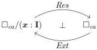
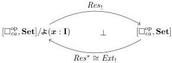

5:48

E. CAVALLO AND R. HARPER

Vol. 17:4

6.2. Bridge interval and restriction. We now turn to the parametric side of the theory. As with the path interval, we interpret bridge interval terms in a context $G$ as morphisms $\boldsymbol{r}: G \to \mathfrak{X}(\boldsymbol{x} : \mathbf{I})$. To interpret bridge interval context extension and restriction, we observe that we have an adjunction between $\square_{ca}$ and its slice category over the affine interval $(\boldsymbol{x} : \mathbf{I})$. Note that elements of this slice category consist of contexts $\Psi$ paired with bridge interval terms $\Psi \Vdash \boldsymbol{r} \in \mathbf{I}$.

The right adjoint $Ext$ sends a context $\Psi$ to the extended context $(\Psi, \boldsymbol{x} : \mathbf{I})$ with its canonical projection $\Psi, \boldsymbol{x} : \mathbf{I} \Vdash \boldsymbol{x} \in \mathbf{I}$. The left adjoint is interval restriction: it sends a pair $(\Psi, \boldsymbol{r})$ to the restricted context $\Psi \setminus \boldsymbol{r}$ defined here as in Section 2.1.

$$\Psi \setminus \varepsilon := \Psi \quad \text{if } \varepsilon \in \{\mathbf{0}, \mathbf{1}\}$$

$$(\Psi, y : \mathbb{I}) \setminus \boldsymbol{x} := \Psi \setminus \boldsymbol{x}, y : \mathbb{I}$$

$$(\Psi, \boldsymbol{y} : \mathbf{I}) \setminus \boldsymbol{x} := \begin{cases} \Psi & \text{if } \boldsymbol{x} = \boldsymbol{y} \\ \Psi \setminus \boldsymbol{x}, \boldsymbol{y} : \mathbf{I} & \text{if } \boldsymbol{x} \neq \boldsymbol{y} \end{cases}$$

This adjunction in the base category induces, among other things, the following pair of adjoint functors between the presheaf category and its slice. We implicitly use the equivalence $[(\square_{ca}/\Psi)^{\mathrm{op}}, \mathbf{Set}] \simeq [\square_{ca}^{\mathrm{op}}, \mathbf{Set}]/\mathfrak{X}\Psi$ between presheaves on slice categories and slices over representables.

Here $Res^*$ is precomposition with $Res$, while $Res_!$ and $Ext_!$ are each defined by left Kan extension. Both $Ext_!$ and $Res^*$ are left adjoint to $Ext^*$, so are necessarily isomorphic. As for $Res_!$, it may be explicitly calculated as the following coend.

$$Res_!(G, \boldsymbol{r})(\Psi) = \int^{\Psi' \Vdash \boldsymbol{s} : \mathbf{I}} \{g \in G(\Psi') \mid \boldsymbol{r}(\Psi')(g) = \boldsymbol{s}\} \times \{\psi \mid \Psi \Vdash \psi \in \Psi' \setminus \boldsymbol{s}\}$$

For our purposes, however, it is only necessary to know that the extensions $Res_!$ and $Ext_!$ apply the base functors on representables, that is, that $Res_!(\mathfrak{X}\Psi, \boldsymbol{r}) \cong \mathfrak{X}(\Psi \setminus \boldsymbol{r})$ and $Ext_!(\mathfrak{X}\Psi) \cong \mathfrak{X}(\boldsymbol{x}/\boldsymbol{x}) : \mathfrak{X}(\Psi, \boldsymbol{x} : \mathbf{I}) \to \mathfrak{X}(\boldsymbol{x} : \mathbf{I})$; this is a general property of Kan extensions. Henceforth we write $G \otimes \mathbf{I}$ for the object part of $Ext_!G$ and $var(G) : G \otimes \mathbf{I} \to \mathfrak{X}(\boldsymbol{x} : \mathbf{I})$ for the associated projection.

We use $Res_!$ to interpret the type-theoretic restriction of a context by an interval term, likewise $-\otimes \mathbf{I}$ to interpret extension by an interval variable and $var(G)$ for the variable rule. The isomorphism between hom-sets given by the adjunction $Res_! \dashv Ext_!$ implements the substitution constructors SUBST-I and SUBST-RESTRICT. The structural rules for the bridge interval derive from natural transformations in the base category via the action of $(-)_!$; for example, the endpoint transformation $\varepsilon : Id \to \pi \circ Ext$ defined by