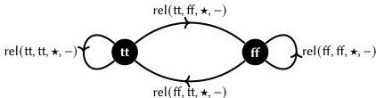

88 Introduction

cases with a path in $D$ connecting the images of the two zeroes, *i.e.*, functions on the elements that respect the quotienting equality.

Thinking more generally, we can express the general idea of quotienting by a relation with a higher inductive type that takes the relation as a parameter. Given a type $A \in \mathbb{U}$, a binary relation on $A$ is a family of types $R \in A \times A \to \mathbb{U}$: for each pair $a, a' \in A$, we think of $R \langle a, a' \rangle \in \mathbb{U}$ as the type of proofs that $a$ and $a'$ are related by $R$. Given such a relation, we can define the quotient of $A$ by $R$ as follows.

$$\begin{aligned} A: \mathbb{U}, R: A \times A \to \mathbb{U} &\gg \textbf{inductive } A \parallel R \textbf{ where} \\ | \operatorname{pt}(a: A) \in A \parallel R \\ | \operatorname{rel}(a: A, a': A, r: R \langle a, a' \rangle, x: \mathbb{I}) \in A \parallel R \quad [x \equiv 0 \hookrightarrow \operatorname{pt}(a) \mid x \equiv 1 \hookrightarrow \operatorname{pt}(a')] \end{aligned}$$

The quotient of $A$ by $R$ has a point for every point of $A$, and draws a path between $\operatorname{pt}(a)$ and $\operatorname{pt}(a')$ whenever there is some $r \in R \langle a, a' \rangle$. To define a map out of this type into some $D$, we specify a map from $A$ to $D$ together with a path between the image of every pair of related elements.

It would seem at first glance that this single higher inductive type is the only one we need, if we are only interested in constructing quotients. The reality is not quite so simple. In a system where equality is contentful, the quotient $A \parallel R$ can behave in ways that are unintuitive to the contentless mind. Although many of the more complex higher inductive types *can* be encoded using only inductive types and $- \parallel -$, we contend that the full generality of higher inductive types is the more natural abstraction in a type theory with contentful equality, as demonstrated by the following example.

**The higher structure of cubical types** To get a feeling for the potentially surprising behavior of $A \parallel R$, let us consider an example. Suppose that we have a *unit type*, Unit, a type with exactly one element $(\star)$, and a *boolean type* Bool, a type with exactly two elements (tt and ff). For any type $A \in \mathbb{U}$, the constant function $\operatorname{Tot}(A) := \lambda_{-}$. Unit $\in A \times A \to \mathbb{U}$ is the *total relation* on $A$, which relates each pair of elements $a, a' \in A$ by way of the witness $\star \in \operatorname{Tot}(A) \langle a, a' \rangle$. If we take the quotient $\operatorname{Bool} \parallel \operatorname{Tot}(\operatorname{Bool})$, we might expect to get a type which is isomorphic to Unit; we have equated every pair of elements in Bool, after all. Instead, we get a type that looks something like the following picture.

