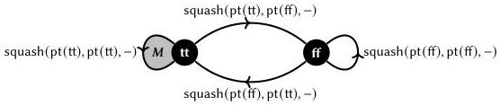

89

Indeed, we have a path between every pair of elements—but because some of these paths are redundant, we wind up with a type that contains non-trivial loops. This type is not isomorphic to Unit; we can even prove as much inside the type theory, using techniques we sketch below. In short, the types of cubical type theory are not characterized purely by their zero-dimensional elements: they have higher structure. The zero-dimensional structure of Bool // Tot(Bool) matches that of Unit—every point is connected by some path to pt(tt)—but their one-dimensional structures differ.

If what we want is an operator on types that collapses the structure of its input, then, quotienting by the total relation will not suffice. Instead, we can take what is called the propositional truncation [Uni13, §3.7], a higher inductive type that is not obviously expressible as a quotient.

$$A : \mathrm{U} \gg \textbf{inductive} \|A\| \textbf{where}$$

$$| \operatorname{pt}(a : A) \in \|A\|$$

$$| \operatorname{squash}(t : \|A\|, t' : \|A\|, x : \mathbb{I}) \in \|A\| \quad [x \equiv 0 \hookrightarrow t \mid x \equiv 1 \hookrightarrow t']$$

Like $A \parallel \operatorname{Tot}(A)$, the propositional truncation contains an element $\operatorname{pt}(a)$ for every $a \in A$. While the former's path constructor identifies every pair of elements coming from $A$, the latter's identifies every pair of elements of $\|A\|$, that is, every pair of elements in the very type being defined. The effect is that the squash constructor does not only collapse the zero-dimensional structure, but can be used recursively to collapse first the one-dimensional structure, then the two-dimensional structure, and so on. For example, consider the following term $x : \mathbb{I}, y : \mathbb{I} \gg M(x, y) \in \|\operatorname{Bool}\|$.

$$M(x, y) := \operatorname{squash}(\operatorname{squash}(\operatorname{pt}(\operatorname{tt}), \operatorname{pt}(\operatorname{ff}), y), \operatorname{pt}(\operatorname{tt}), x)$$

When $x = 0$, the outer squash term is equal to its first argument, $\operatorname{squash}(\operatorname{pt}(\operatorname{tt}), \operatorname{pt}(\operatorname{ff}), y)$; when $x = 1$, it is equal to $\operatorname{pt}(\operatorname{tt})$. This term therefore constructs a homotopy, a path between paths, connecting the constant path $\lambda^1_{-} \operatorname{pt}(\operatorname{tt}) \in \operatorname{Path}(\|\operatorname{Bool}\|, \operatorname{pt}(\operatorname{tt}), \operatorname{pt}(\operatorname{tt}))$ and the "redundant" loop $\lambda^1 y \cdot \operatorname{squash}(\operatorname{pt}(\operatorname{tt}), \operatorname{pt}(\operatorname{ff}), y)$ of the same type. Pictorially, $M$ "fills in" the loop at $\operatorname{pt}(\operatorname{tt})$.

Similar applications of squash fill in the other two holes in this picture. A bit more abstractly, we can visualize $M$ as a square varying in the two axes $x$ and $y$, with edges and