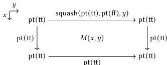

90 Introduction

vertices given by the terms shown below. (In this case, three of the four edges are actually degenerate.)

Of course, the squash constructor also creates many redundant homotopies, just as it creates redundant loops, but these too can be filled in by further iterations of squash. In the end, $\|\text{Bool}\|$ does turn out to be isomorphic to Unit, as is $\|A\|$ for any type that contains at least one element. (If $A$ is empty, then so too is $\|A\|$).

In truth, propositional truncations—and many other HITs, though not all [LS20, §9]—can be indirectly obtained by constructions that rely only the quotient HIT [Doo16; Kra16; Rij17, §7]. However, these constructions are fairly involved; while it is useful to know they are possible, providing general higher inductive types as primitive is much more convenient for the cubical programmer.$^{1}$

The upshot of this example is that identifying elements of a type—a process cleanly accomplished by quotienting in classical mathematics—is a more delicate business when equality is contentful, because we must consider *how* we identify those elements. We can think of this as an acceptable cost of univalence and (what we will see to be) effective quotients. That cost can be mitigated; for one, we can define a *set truncation* HIT that collapses the *higher* structure of a type in the same way that $\|\cdot\|$ collapses *all* structure, and use this to destroy any higher-dimensional structure we inadvertently create.$^{2}$ However, we can also see the higher structure of cubical type theory as a benefit in and of itself, allowing us to use type theory as a language for higher-dimensional mathematics.

**Synthetic homotopy theory** Algebraic topology and homotopy theory are closely related mathematical fields that study objects carrying higher structure: their properties, techniques for classifying them, and so on. Right from the origins of higher-dimensional

$^{1}$Also, the computation rules for path constructors in these encodings often only hold up to path equality, whereas we can get exact equalities with a direct construction.

$^{2}$Taking a different tack along these lines, the type theories **OTT** [AMS07] and **XTT** [SAG19] include contentful equality but nevertheless require that all types have trivial higher structure: proofs of equalities do carry computational content, but all such proofs are interchangeable. Univalent universes do not fit into this paradigm, but effectivity of quotients can be obtained.