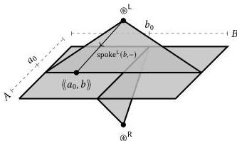

160 Introduction

is left adjoint to $\rightarrow_*$.

$$
\begin{aligned}
(A \times B) &\rightarrow C \simeq A \rightarrow (B \rightarrow C) \\
(A_* \wedge_* B_*) &\rightarrow_* C_* \simeq A_* \rightarrow_* (B_* \rightarrow_* C_*)
\end{aligned}
$$

In cubical type theory, we can define the smash product as the following higher inductive type [Doo18, Definition 4.3.6].

$$
\begin{aligned}
A_* : \cup_*, B_* : \cup_* &\gg \textbf{inductive } A_* \wedge B_* \textbf{ where} \\
&| \langle \langle a : A, b : B \rangle \rangle \in A_* \wedge B_* \\
&| \circledast^L \in A_* \wedge B_* \\
&| \text{spoke}^L(b : B, x : \mathbb{I}) \in A_* \wedge B_* \quad [x \equiv 0 \hookrightarrow \circledast^L \mid x \equiv 1 \hookrightarrow \langle \langle a_0, b \rangle \rangle] \\
&| \circledast^R \in A_* \wedge B_* \\
&| \text{spoke}^R(a : A, x : \mathbb{I}) \in A_* \wedge B_* \quad [x \equiv 0 \hookrightarrow \circledast^R \mid x \equiv 1 \hookrightarrow \langle \langle a, b_0 \rangle \rangle]
\end{aligned}
$$

The smash product of $A_*$ and $B_*$ is a quotient of the product $A \times B$; we start with elements $\langle \langle a, b \rangle \rangle \in A_* \wedge B_*$ for every $a \in A$ and $b \in B$, then identify all pairs of the form $\langle \langle a_0, b \rangle \rangle$ or $\langle \langle a, b_0 \rangle \rangle$. The latter is accomplished by first adding two “hub” points $\circledast^L$ and $\circledast^R$, then equating all terms of the form $\langle \langle a_0, b \rangle \rangle$ and $\langle \langle a, b_0 \rangle \rangle$ with $\circledast^L$ and $\circledast^R$ respectively using “spoke” path constructors. We can picture the smash product as in the following image, with the two axes of the product $A \times B$ connected to their respective hub points.

We write $A_* \wedge_* B_*$ for the pointed type $\langle A_* \wedge B_*, \langle \langle a_0, b_0 \rangle \rangle$.

The precise definition of the smash product, the intuition behind it, and its use in algebraic topology are not our focus here. Rather, we want to make some generic points about the difficulty of proving results that involve higher inductive types. The smash product appears repeatedly in work on synthetic homotopy, for example in the theses of Brunerie [Bru16, Chapter 4] and Van Doorn [Doo18, §4.3]. In both these cases, a major