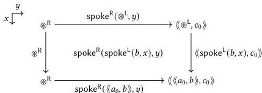

162 Introduction

boundary.

Our goal for the two-dimensional spoke$^{R}$(spoke$^{L}$(b, x), y) case thus depends on what we have written in the zero- and one-dimensional $\otimes^R$, spoke$^{R}$($\otimes^L$, y), ($\langle\langle\otimes^L\rangle(b, x), c\rangle\rangle$, and spoke$^{R}$($\langle\langle a, b\rangle\rangle, y$) cases. In particular, the complexity of higher-dimensional cases is very sensitive to the complexity of lower-dimensional cases. If, for example, each one-dimensional case involves some non-trivial composition of constructors, then it falls to the two-dimensional constructors to untangle and relate these. Worse, the complexity often depends on essentially arbitrary choices. For example, we can equally well send $\otimes^L \mapsto \otimes^L$, $\otimes^L \mapsto \otimes^R$, $\otimes^L \mapsto \langle\langle\otimes^L, c_0\rangle\rangle$, $\otimes^L \mapsto \langle\langle\otimes^R, c_0\rangle\rangle$, or $\otimes^L \mapsto \langle\langle\langle a_0, b_0\rangle\rangle, c_0\rangle\rangle$, given that all of these options are equal up to a path. If we send $\otimes^L \mapsto \otimes^L$, then the spoke$^{L}$(c, x) case requires a path $\otimes^L \rightsquigarrow \langle\langle a_0, \langle\langle b_0, c\rangle\rangle\rangle\rangle$, which is easily satisfied by spoke$^{L}$($\langle\langle b_0, c\rangle\rangle, x$); if we send $\otimes^L \mapsto \otimes^R$, the necessary path $\otimes^R \rightsquigarrow \langle\langle a_0, \langle\langle b_0, c\rangle\rangle\rangle\rangle$ cannot be satisfied with a single constructor, instead requiring some composition. Sometimes it is clear which choice produces the simplest higher-dimensional goals, but it is often not.

These problems are further exacerbated if we want to prove any properties of these definitions. For example, we would certainly like to know that the associator is an isomorphism. After defining a candidate inverse assoc$^{-1}$, we would then have to construct some inv $\in (s : (A_* \wedge_* B_*) \wedge C_*) \to \text{Path}((A_* \wedge_* B_*) \wedge C_*, \text{assoc}^{-1}(\text{assoc } s), s)$. Like the definition of assoc itself, this requires twice-iterated case analysis on the smash product. This time, however, the codomain is a path type, so the dimensionality of each case is bumped up by one. And again, our solution for each case of inv depends in a delicate way on how we have defined assoc and assoc$^{-1}$ as well as the lower-dimensional cases of inv.

Worse still, there are actually infinitely many coherence conditions of increasing dimensionality that one might like the commutator and associator (and unitors) to satisfy. One step up from associativity, we have *Mac Lane's pentagon identity*, which states that the following diagram commutes. In words, the pentagon asserts that the two ways of re-associating from $((A_* \wedge_* B_*) \wedge_* C_*) \wedge D_*$ to $A_* \wedge (B_* \wedge_* (C_* \wedge_* D_*))$—beginning either