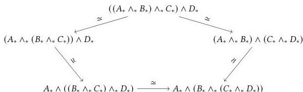

163

by re-associating the inner or the outer triple—produce the same results.

To prove this would require a case analysis on the elements of a *thrice*-iterated smash product. As the codomain is again a path type, this means dealing with four-dimensional terms. Then we might require a further coherence operator relating the different ways of iteratively applying the pentagon identity, and so on without end. (These operators are collectively known as *associahedra*.) To add another wrinkle of complexity, each of these operators should also satisfy a *naturality* condition that lives one dimension higher.

Admittedly, there is (as yet) no pressing need in synthetic homotopy theory to climb very far up this tower of results. However, both Brunerie and Van Doorn's results do rely on the pentagon identity. Brunerie does not give a proof, only sketches an argument that one should be possible. Van Doorn adapts a result of Eilenberg and Kelly [EK66, Chapter 2, Theorem 5.3] to derive the pentagon identity from the *pointed natural isomorphism* transpose $\in (A_* \wedge_* B_*) \to_* C_* \simeq_* A_* \to_* (B_* \to_* C_*)$. It is plausible that the higher coherences would also follow from this result without further case analysis, which would be a substantial reduction of complexity from the direct approach. However, even the construction of transpose is non-trivial, and Van Doorn leaves one component of the proof unchecked.$^1$ Brunerie has also attempted to generate proofs of these coherences automatically, using an algorithm that looks for opportunities to apply Martin-Löf's identity elimination rule, but this too reaches the limits of practicality around the pentagon level [Bru18].

Despite the difficulty of verifying these results, the proofs are not at all conceptually interesting, and it is hard to imagine how they could fail to hold. Is it even possible to write down an associator that does not satisfy the pentagon identity? In fact, under sufficient restrictions on the language, *it is not*. We will arrive at this realization by using a classic technique from programming language theory: *parametricity*.

$^1$The missing piece is described in [Doo18, Remark 4.3.29]. Briefly, naturality requires an operation relating the isomorphisms $(A_* \wedge_* B_*) \to_* C_* \simeq_* A_* \to_* (B_* \to_* C_*)$ and $(A'_* \wedge_* B'_*) \to_* C'_* \simeq_* A'_* \to_* (B'_* \to_* C'_*)$ whenever there are pointed functions $A_* \to A'_*, B_* \to B'_*,$ and $C_* \to C'_*$. *Pointed* naturality requires that this operation satisfies a further condition when one of $f, g, h$ is a constant function. Van Doorn relies on pointed naturality in $C$ to obtain the pentagon identity, but does not show that it holds.