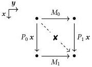

176

Parametric cubical type theory

Proof. By definition of the open typing judgment, we must show for every $\Psi \Vdash \gamma = \gamma' \in \Gamma$ that $\Psi \Vdash ((\lambda^\mathbf{I}\mathbf{x}.M)\mathbf{r})\gamma = M[\mathbf{r}/\mathbf{x}]\gamma' \in A[\mathbf{r}/\mathbf{x}]\gamma$. By instantiating $\Gamma, \mathbf{x} : \mathbf{I} \gg A$ type with $(\gamma, \mathbf{x}/\mathbf{x})$, we have $\Psi, \mathbf{x} : \mathbf{I} \Vdash A\gamma$ type; by instantiating $\Gamma \gg \mathbf{r} \in \mathbf{I}$ with $\gamma$, we have $\Psi \Vdash \mathbf{r}\gamma \in \mathbf{I}$; by instantiating $\Gamma \setminus \mathbf{r}, \mathbf{x} : \mathbf{I} \gg M \in A$ with $\Psi \setminus \mathbf{r}\psi \Vdash (\gamma : \Gamma) \setminus \mathbf{r}$, we have $\Psi \setminus \mathbf{r}\gamma, \mathbf{x} : \mathbf{I} \Vdash M\gamma \in A\gamma$. We thus obtain $\Psi \Vdash ((\lambda^\mathbf{I}\mathbf{x}.M)\mathbf{r})\gamma = M[\mathbf{r}/\mathbf{x}]\gamma' \in A[\mathbf{r}/\mathbf{x}]\gamma$ by applying the closed rule. $\square$

To give a concrete consequence of affinity, we cannot take the diagonal of a two-dimensional bridge. That is, given a term $Q \in \text{Bridge}(\mathbf{y}.\text{Bridge}(A, M_0, M_1), P_0, P_1)$, we cannot write the term “$\lambda^\mathbf{I}\mathbf{x}.Q\mathbf{x}\mathbf{x} \in \text{Bridge}(A, P_0\mathbf{0}, P_1\mathbf{1})$”, the diagonal of the square shown below.

Indeed, the term $Q\mathbf{x}$ already mentions $\mathbf{x}$, so cannot be applied to $\mathbf{x}$ a second time.

Note, however, that nothing prevents a bridge variable from occurring multiple times in a term in general. We see an example in the proof of the following lemma, which is a carbon copy of Lemma 3.2.4.

Lemma 9.2.2 (Bridges in products). Let $\mathbf{x} : \mathbf{I} \gg A$ type and $\mathbf{x} : \mathbf{I}, a : A \gg B$ type be given together with $T_0 \in ((a : A) \times B)[\mathbf{0}/\mathbf{x}]$ and $T_1 \in ((a : A) \times B)[\mathbf{1}/\mathbf{x}]$. Then we have an isomorphism of the following type.

$$\begin{array}{c} \text{Bridge}(\mathbf{x}.(a : A) \times B, T_0, T_1) \\ \simeq \\ (p : \text{Bridge}(\mathbf{x}.A, \text{fst}(T_0), \text{fst}(T_1))) \times \text{Bridge}(\mathbf{x}.B[p\mathbf{x}/a], \text{snd}(T_0), \text{snd}(T_1)) \end{array}$$

Proof. In the forward direction, given $t : \text{Bridge}(\mathbf{x}.(a : A) \times B, T_0, T_1)$, we have the pair of bridges $\langle \lambda^\mathbf{I}\mathbf{x}.\text{fst}(t\mathbf{x}), \lambda^\mathbf{I}\mathbf{x}.\text{snd}(t\mathbf{x}) \rangle$. In the reverse, given a pair of bridges across the two types, $p : \text{Bridge}(\mathbf{x}.A, \text{fst}(T_0), \text{fst}(T_1))$ and $q : \text{Bridge}(\mathbf{x}.B[p\mathbf{x}/a], \text{snd}(T_0), \text{snd}(T_1))$, we have a bridge in the product type $\lambda^\mathbf{I}\mathbf{x}.\langle p\mathbf{x}, q\mathbf{x} \rangle$. These constructions are inverse up to exact equality. $\square$

In the term $\lambda^\mathbf{I}\mathbf{x}.\langle p\mathbf{x}, q\mathbf{x} \rangle$ above, we have used $\mathbf{x}$ in two places, but this is not a problem: the only requirement is that $\mathbf{x}$ be fresh for $p$ and $q$ individually. This is the case here