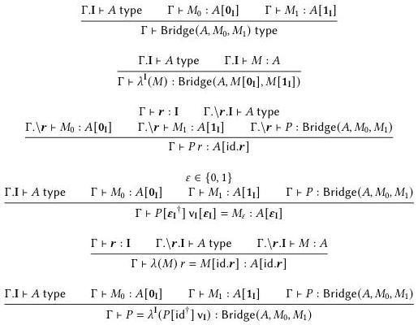

212

Formalism and models

Figure 11.1: Rules for bridge types in a parametric type theory formalism

## 11.1 Bicubical set model

We can build a non-computational model in the category of Kan presheaves following the pattern established in Section 3.3.1. This time around, our presheaves are over the interval contexts of parametric cubical type theory, i.e., contexts of bridge and path interval variables.

Definition 11.1.1. The cartesian-affine bicube category $\widehat{\mathbb{D}}_{c \times a}$ is the category whose objects are interval contexts $\Psi$ ictx of parametric cubical type theory and whose morphisms $\psi \in \widehat{\mathbb{D}}_c[\Psi', \Psi]$ from $\Psi'$ to $\Psi$ are interval substitutions $\Psi' \Vdash \psi \in \Psi$.

Because we have exchange between path and bridge interval variables, $\widehat{\mathbb{D}}_{c \times a}$ is equivalent to the product $\widehat{\mathbb{D}}_c \times \widehat{\mathbb{D}}_a$ of the cartesian cube category $\widehat{\mathbb{D}}_c$ from Section 3.3.1 and the category $\widehat{\mathbb{D}}_a$ of bridge variables and substitutions, but we do not need this fact here.

Within the presheaf category $PSh(\widehat{\mathbb{D}}_{c \times a})$, we have two interval objects provided by the Yoneda embedding: the path interval $\mathbb{I} := \mathcal{L}(x:\mathbb{I})$ is joined by a bridge interval $\mathbf{I} := \mathcal{L}(x:\mathbf{I})$.