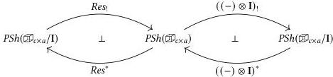

Bicubical set model 215

Returning to cubical sets, we thus we have two pairs of induced adjoint functors on presheaves as shown in the diagram below.

Henceforth we abbreviate $\mathbf{I}_! := ((-) \otimes \mathbf{I})_!$ and $\mathbf{I}^* := ((-) \otimes \mathbf{I})^*$. The fact that $Res$ is left adjoint to $(-) \otimes \mathbf{I}$ moreover implies that $Res^*$ is also left adjoint to $\mathbf{I}^*$. This implies that in fact $\mathbf{I}_! \cong Res^*$: both are left adjoint to $\mathbf{I}^*$ (or right adjoint to $Res_!$) and adjoints are uniquely determined.

Finally, the category $PSh(\widehat{\mathbb{D}}_{c \times a}/\mathbf{I})$ is equivalent to the slice category $PSh(\widehat{\mathbb{D}}_{c \times a})/\mathbf{I}$. If we thereby regard these functors as going between $PSh(\widehat{\mathbb{D}}_{c \times a})$ and $PSh(\widehat{\mathbb{D}}_{c \times a})/\mathbf{I}$, we may calculate the effect of $Res_! : PSh(\widehat{\mathbb{D}}_{c \times a})/\mathbf{I} \rightarrow PSh(\widehat{\mathbb{D}}_{c \times a})$ for $(G, g) \in PSh(\widehat{\mathbb{D}}_{c \times a})/\mathbf{I}$ and $\Psi \in \widehat{\mathbb{D}}_{c \times a}$ as follows.

$$Res_!(G, g)(\Psi) = \left\{ (\Phi, s, \psi, t) \left| \begin{array}{l} \Phi \text{ ictx} \\ \Phi \Vdash s \in \mathbf{I} \\ \Psi \Vdash \psi \in \Phi \setminus s \\ t \in P(\Phi) \\ g(\Phi)(t) = s \end{array} \right. \right\} / \approx$$

Here $\approx$ is the equivalence relation generated by $(\Phi, s, \psi, t) \approx (\Phi', s', \psi', t')$ whenever there is some $\Phi' \Vdash \phi \in \Phi$ such that $\Phi' \Vdash s' = s\phi \in \mathbf{I}$, $\Psi \Vdash \psi = ((\phi : \Phi) \setminus s)\psi' \in \Phi \setminus s$, and $P(\phi)(t) = t'$. The functor $\mathbf{I}_!$, meanwhile, is more simply obtained as follows, reflecting its characterization as $Res^*$.

$$\mathbf{I}_!(G) = (G', g) \text{ where } \left\{ \begin{array}{l} G'(\Psi) := \sum_{\Psi \Vdash r \in \mathbf{I}} G(\Psi \setminus r) \\ g(\Psi)(r, t) := r \end{array} \right.$$

With these tools in hand, we begin interpreting the parametricity elements of the formalism. We interpret bridge interval terms $\Gamma \vdash r : \mathbf{I}$ by morphisms $[[r]] : [\Gamma] \rightarrow \mathbf{I}$. For any semantic context $G$, we interpret its extension by a bridge interval by as $\pi_0(\mathbf{I}_!(G)) \in PSh(\widehat{\mathbb{D}}_{c \times a})$, with the accompanying variable projection given by $\pi_1(\mathbf{I}_!(G)) : G \rightarrow \mathbf{I}$; notice that the definition of $\mathbf{I}_!(G)$ is exactly what we would expect from context extension. From the calculation of $\mathbf{I}_!(G)$ above, it is straightforward to check that it validates the structural rules we require of the bridge interval. We likewise interpret context restriction by $Res_!$, the left adjoint to $\mathbf{I}_!$.