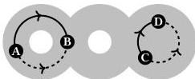

Equality in type theory 11

using. Isomorphism is therefore a contentful notion of equality, in that the way we use an equality depends on the contents of its proof (the functions defining the isomorphism).

To be clear, this kind of equality is usually exercised on an *informal* level in everyday mathematics. While it is possible to give precise definitions of “group-theoretic property” so that one can transport such properties between isomorphic groups, this is simply taken for granted in most mathematical writing. Isomorphisms are tacitly treated as if they were true equalities, because experience suggests that this kind of shortcut is harmless and can be eliminated by anyone who cares to be precise.

Remarkably, however, this informal use of contentful equality can not only be integrated with type theory in a completely precise way, but actually resolves several long-standing issues with existing treatments of equality, and has moreover been latent in some versions of dependent type theory since the genesis of the field. The key idea is to see equality as something along which we can *transport* results, where the effect of the transport may depend on the proof of the equality. This principle is embodied in Martin-Löf’s elimination rule for equality types, the so-called *J rule*.

**Equality as path** Contentful relations also appear extensively in the fields of (algebraic) topology and homotopy theory in the form of *paths in a space*. These fields study abstract notions of spaces (which we will avoid defining precisely here); a *path* is simply a way to get from one point in a space to another. Let us take the following image as an example of a two-dimensional space $X$, with marked points **A,B,C,D** and a few examples of paths between them.

A path from one point to another is a contentful relationship between them: we can ask not only *whether* a path exists, but *which* path it is. Indeed, one of the central techniques for classifying spaces in algebraic topology is to count the number of “distinct” paths between given pairs of points. To do so, we also need a criterion for when two paths between a given pair of points are “distinct” or “the same”. The standard device is to say that two paths are the same when there is a *homotopy* between them: a way to smoothly deform one path into the other. In our example, the two paths from **C** to **D** are homotopic, but the two paths from **A** to **B** are not, as the hole between them prevents us from deforming one into the other. A homotopy is essentially a *path between paths*; it too is a contentful relationship, one between paths rather than points. We can go further and consider paths between paths between paths and so forth.