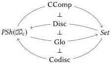

229

certain properties.

The third functor in this chain, Glo, is the *global sections* functor, which takes a cubical set $G$ and produces its set of underlying points $\operatorname{Glo}(G) := G(\cdot)$. Above it is Disc, the *discrete embedding*, which takes a set $S$ and produces a cubical set with a point for every point of $S$ and trivial higher-dimensional path structure: $\operatorname{Disc}(S)(\Psi) := S$ for all $\Psi$. Disc is *adjoint* to Glo, which means that cubical set functions $\operatorname{Disc}(S) \to G$ are in natural correspondence with set functions $S \to \operatorname{Glo}(G)$: drawing a picture of a cubical set $\operatorname{Disc}(S)$ consisting only of points $S$ in the cubical set $G$ is the same as drawing a picture of $S$ in the set $\operatorname{Glo}(G)$ of points of $G$. We say that Disc is the *left adjoint* and Glo is the *right adjoint* and write $\operatorname{Disc} \dashv \operatorname{Glo}$ to express the relationship between them.

On the other side of Disc, a right adjoint *codiscrete embedding* Codisc turns a set into a cubical set by adding paths between every pair of elements (and higher-dimensional cubes between these paths); here we have a correspondence between set functions $\operatorname{Glo}(G) \to S$ and cubical set functions $G \to \operatorname{Codisc}(S)$, making Glo left adjoint to Codisc. Finally, the furthest left adjoint is the *connected components* functor, which takes a cubical set to a set by quotienting the set of points (*i.e.*, global sections) by the path relation: we define $\operatorname{CComp}(G) := G(\cdot)/\approx$ where $\approx$ is the following relation.

$$a \approx b : \Longleftrightarrow \exists p \in G(x : \mathbb{I}). G(0/x)(p) = a \wedge G(1/x)(p) = b$$

For cohesive parametric type theory, we are interested in the cohesive structure of parametric cubical type theory over ordinary cubical type theory. Thus the objects of both the “cohesive” and “underlying points” categories are equipped with cubical structure, but the objects of the cohesive category also carry *bridge* structure.

To translate this picture into our type-theoretic setting, we follow Shulman [Shu18] in using a system of *modalities*. Loosely speaking, a modality is simply a unary operator on types; the terminology originates in *modal logic*, which generalizes formal logic from statements about truth—e.g., “the proposition $P$ is true”—to statements such as “$P$ is necessary” or “$P$ is possible”. These different *modes* in which we may consider a statement are related by *modalities*, operators on propositions that transfer between modes. For example, we might define the proposition “$\square P$” (“necessarily $P$”) to be *true* when $P$ is *necessary*.