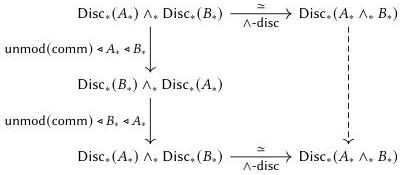

Iterated smash products

277

By functoriality of $\blacklozenge_{*}$ and the path $\wedge$-disc$^{-1}$ $\circ_{*}\wedge$-disc $\rightsquigarrow$ id$_{*}$($B_{*}\wedge_{*}A_{*}$), the left-hand side is path-equal to the image by $\blacklozenge_{*}(\mathrm{mod}(-))$ of the following dashed composite.

The composite map on the left is an instance of a parametrically polymorphic function:

$$
\lambda X_{*}.\lambda Y_{*}.\text{unmod(comm)} Y_{*}X_{*}\circ_{*}\text{unmod(comm)} X_{*}Y_{*}
$$

$$
(X_{*},Y_{*}:\mathsf{U}_{*})\to X_{*}\wedge_{*}Y_{*}\to_{*}X_{*}\wedge_{*}Y_{*}
$$

By assumption, this function sends $\langle\langle\mathrm{ff},\mathrm{ff}\rangle\rangle$ to $\langle\langle\mathrm{ff},\mathrm{ff}\rangle\rangle$ when instantiated at $\mathrm{Bool}_{*}$ and $\mathrm{Bool}_{*}$. By our characterization of such polymorphic functions in Part III, namely Theorem 10.5.11, we can conclude it is path-equal to the identity function. Thus we have

$$
\begin{array}{l}
\operatorname{comm}_{\mathrm{pt}}B_{*}A_{*}\circ_{*}\operatorname{comm}_{\mathrm{pt}}A_{*}B_{*}\rightsquigarrow\blacklozenge_{*}(\wedge\text{-disc}\circ_{*}\wedge\text{-disc}^{-1}) \\
\rightsquigarrow\blacklozenge_{*}(\operatorname{id}_{*}(A_{*}\wedge_{*}B_{*})) \\
\rightsquigarrow \operatorname{id}_{*}(A_{*}\wedge_{*}B_{*})
\end{array}
$$

as required.

**Associativity and the pentagon** We can apply the same chain of reasoning to the associator, obtaining not only the isomorphism inverse conditions but also the pentagon by parametricity.

**Assumption 15.4.10.** We assume given a global associator and candidate inverse as follows.

$$
\begin{array}{l}
\operatorname{assoc}\in\operatorname{Glo}((A_{*},B_{*},C_{*}:\mathsf{U}_{*})\to(A_{*}\wedge_{*}B_{*})\wedge_{*}C_{*}\to A_{*}\wedge_{*}(B_{*}\wedge_{*}C_{*}))\text{@ pt} \\
\operatorname{assoc}^{-1}\in\operatorname{Glo}((A_{*},B_{*},C_{*}:\mathsf{U}_{*})\to A_{*}\wedge_{*}(B_{*}\wedge_{*}C_{*})\to(A_{*}\wedge_{*}B_{*})\wedge_{*}C_{*})\text{@ pt}
\end{array}
$$

We assume moreover that these terms satisfy the following path equalities.

$$
\begin{array}{l}
\operatorname{assoc}\operatorname{Bool}_{*}\operatorname{Bool}_{*}\operatorname{Bool}_{*}\langle\langle\langle\mathrm{ff},\mathrm{ff}\rangle\rangle,\mathrm{ff}\rangle\rightsquigarrow\langle\langle\mathrm{ff},\langle\langle\mathrm{ff},\mathrm{ff}\rangle\rangle\rangle \\
\operatorname{assoc}^{-1}\operatorname{Bool}_{*}\operatorname{Bool}_{*}\operatorname{Bool}_{*}\langle\langle\mathrm{ff},\langle\langle\mathrm{ff},\mathrm{ff}\rangle\rangle\rangle\rightsquigarrow\langle\langle\langle\mathrm{ff},\mathrm{ff}\rangle\rangle,\mathrm{ff}\rangle\rangle
\end{array}
$$