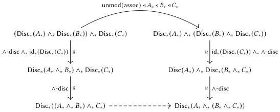

278

Programming in cohesive parametric type theory

Definition 15.4.11 (Associator shadow). Given pointwise types $A_*, B_*, C_* : U_*$, we define $\text{assoc}_{\text{pt}} A_* B_* C_* \in (A_* \land_* B_*) \land_* C_* \to A_* \land_* (B_* \land_* C_*)$ @ pt as in the case of the commutator, as the image under $\blacklozenge_* (\text{mod}(-))$ of the following composite.

We likewise define $\text{assoc}_{\text{pt}}^{-1} A_* B_* C_* \in A_* \land_* (B_* \land_* C_*) \to (A_* \land_* B_*) \land_* C_*$ @ pt.

The statement of the pentagon identity involves the action of the smash product on pointed functions. As with function identity and composition, we therefore need that the parametric and pointwise action correspond across the $\blacklozenge_*$ isomorphism. As our objective is to avoid reasoning about the smash product, we take the way out suggested in our discussion of Proposition 15.4.8, defining the pointwise action so that the correspondence is immediate.

Definition 15.4.12. Given pointwise pointed functions $f_* : A_* \to C_*$ and $g_* : B_* \to D_*$, we define the map $f_* \land_*^{\text{pt}} g_* \in (A_* \land B_*) \to_* (C_* \land D_*)$ as the "shadow" of its parametric analogue (defined in Definition 10.5.6).

$$g_* \land_*^{\text{pt}} f_* := \blacklozenge_* (\text{mod}(\land\text{-disc} \circ_* (\text{unmod}(\Diamond_* g_*) \land_* \text{unmod}(\Diamond_* f_*)) \circ_* \land\text{-disc}^{-1}))$$

Now we have the main theorem, which proceeds exactly as with commutativity.

Theorem 15.4.13. $\text{assoc}_{\text{pt}}$ is a family of isomorphisms and satisfies the pentagon identity.

Proof. To show that $\text{assoc}_{\text{pt}}$ is an isomorphism, it suffices to construct two paths as follows for every $A_*, B_*, C_* : U$.

$$\begin{array}{l} \text{assoc}_{\text{pt}}^{-1} A_* B_* C_* \circ_* \text{assoc}_{\text{pt}} A_* B_* C_* \rightsquigarrow \text{id}_*((A_* \land_* B_*) \land_* C_*) \\ \text{assoc}_{\text{pt}} A_* B_* C_* \circ_* \text{assoc}_{\text{pt}}^{-1} A_* B_* C_* \rightsquigarrow \text{id}_*(A_* \land_* (B_* \land_* C_*)) \end{array}$$