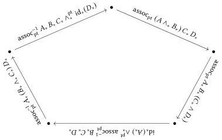

Iterated smash products

279

Without loss of generality, we restrict attention to the first. As in the proof of Theorem 15.4.9, the functoriality of $\blacklozenge_{*}$ allows us to reduce our goal to proving that the following parametrically polymorphic function is the identity.

$$
\begin{array}{c}
\lambda X_{*}, \lambda Y_{*}, \lambda Z_{*}, \text{unmod}(\text{assoc}^{-1}) X_{*} Y_{*} Z_{*} \circ_{*}, \text{unmod}(\text{assoc}) X_{*} Y_{*} Z_{*} \\
\updownarrow \\
(X_{*}, Y_{*}, Z_{*}: U_{*}) \to (X_{*} \wedge_{*} Y_{*}) \wedge_{*} Z_{*} \to_{*} (X_{*} \wedge_{*} Y_{*}) \wedge_{*} Z_{*}
\end{array}
$$

We finish by applying Theorem 10.5.11. Finally, the pentagon identity asserts that the following round-trip composite is the identity function on $((A_{*} \wedge_{*} B_{*}) \wedge_{*} C_{*}) \wedge_{*} D_{*}$.

Using the fact that $\blacklozenge_{*}$ commutes with identities, composition, and the action of the smash product on pointed functions (that is, converts $\wedge_{*}$ to $\wedge_{*}^{\mathrm{pt}}$), we again reduce this to an equation on a composite of parametric functions and apply Theorem 10.5.11. $\square$

These first few coherences give a sense of the effectiveness and limitations of our approach. The method is easiest to apply when all the constructions involved in the coherence are induced from parametric constructions. In the statement of the pentagon identity, for example, we use $\mathrm{id}_{*}$, $\circ_{*}$, $\wedge_{*}^{\mathrm{pt}}$, $\mathrm{assoc}_{\mathrm{pt}}$, and $\mathrm{assoc}_{\mathrm{pt}}^{-1}$. We have defined the latter three terms as the shadows of parametric constructions, making the relationship between the parametric and pointwise equivalents obvious. For $\mathrm{id}_{*}$ and $\circ_{*}$, we instead require a lemma (Proposition 15.4.8) connecting the naive pointwise definition to the shadow of some parametric term. For low-dimensional constructions like these two, the latter is feasible; for a term like the associator, on the other hand, it would be much more difficult to relate the “naive” pointwise definition to the shadow of $\mathrm{assoc}_{\mathrm{pt}}$. On the other hand, the exact definition of $\mathrm{assoc}_{\mathrm{pt}}$ is less likely to be important to future “non-free” theorems