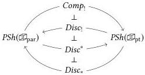

286

Formalism

**Modal operators** As with the interpretation of bridge interval context extension and restriction, we derive the modal context operators from functors between the two cube categories. We have two such functors, the connected components functor $Comp : \mathfrak{D}_{\text{par}} \to \mathfrak{D}_{\text{pt}}$ and discrete embedding $Disc : \mathfrak{D}_{\text{pt}} \to \mathfrak{D}_{\text{par}}$, both obtained by assembling the operations defined in Figures 14.1 and 14.2.

$$Comp(\Psi) := \Psi.\text{cc}$$

$$Disc(\Psi) := \Psi.\text{dsc}$$

$$Comp(\Psi' \Vdash \psi \in \Psi) := (\psi : \Psi) \otimes \text{cc}$$

$$Disc(\Psi' \Vdash \psi \in \Psi) := (\psi : \Psi) \otimes \text{dsc}$$

Per Proposition 14.2.14, $Comp$ is left adjoint to $Disc$. Note that the global sections operator cannot be defined as a map between the cube categories: the category $\mathfrak{D}_{\text{pt}}$ contains no "endpoint object".

As described in Section 11.1, a functor $F : \mathcal{C} \to \mathcal{D}$ between index categories induces an adjoint triple $F_! \dashv F^* \dashv F_*$ between the presheaf categories $PSh(\mathcal{C})$ and $PSh(\mathcal{D})$, with the central functor $F^* : PSh(\mathcal{D}) \to PSh(\mathcal{C})$ given by precomposition—$F^*(P)(c) = G(P(c))$—and $F_!, F_* : PSh(\mathcal{C}) \to PSh(\mathcal{D})$ by left and right Kan extension respectively. Applying with $Comp$ and $Disc$, we have in particular the following adjoint quadruple, our cohesion situation. Here we also use the fact that $Comp \dashv Disc$ implies $Comp_! \dashv Disc!$.

We interpret contexts in the pointwise mode as objects of $PSh(\mathfrak{D}_{\text{pt}})$ and contexts in the parametric mode as objects of $PSh(\mathfrak{D}_{\text{par}})$. The first three functors of the quadruple above accordingly implement the three modal operators on contexts: we interpret $-.\text{cc}$ by $Comp_!$, $-.\text{dsc}$ by $Disc_!$, and $-.\text{glo}$ by $Disc^*$. Recall again that $F_!(\mathfrak{A}(c)) \cong \mathfrak{A}(F(c))$, so we know the connected components and discrete functors have the desired behavior on interval hypotheses: $Comp_!(\mathbf{I}) \cong \mathfrak{A}(\cdot)$, $Disc_!(\mathbb{I}_{\text{pt}}) \cong \mathbb{I}_{\text{par}}$, and so on. (We henceforth use pt and par subscripts to disambiguate between objects in $PSh(\mathfrak{D}_{\text{pt}})$ and $PSh(\mathfrak{D}_{\text{par}})$ when necessary.) We can also quickly check that the connected components and global sections functors cancel the discrete embedding, using formal properties of $(-)_!$ and $(-)^*$.

$$Comp_! \circ Disc_! \cong (Comp \circ Disc)_! \cong (id_{\mathfrak{D}_{\text{pt}}})_! \cong id_{PSh(\mathfrak{D}_{\text{pt}})}$$

$$Disc^* \circ Disc_! \cong Disc^* \circ Comp^* \cong (Comp \circ Disc)^* \cong (id_{\mathfrak{D}_{\text{pt}}})^* \cong id_{PSh(\mathfrak{D}_{\text{pt}})}$$