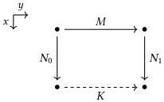

50

Cubical type theory

The second Kan operation, homogeneous composition (hcom), serves a more technical purpose. Note that the existence of coercion at all type lines implies that paths are transitive and symmetric. For example, given $P \in \text{Path}(A, M_0, M_1)$, we can compute its inverse as $\text{coe}_{x.\text{Path}(A, P, x, M_0)}^{0 \to 1} (\lambda^\mathbb{I} x \cdot M_0) \in \text{Path}(A, M_1, M_0)$. Turning this around, however, we will find that we need paths to be symmetric and transitive in order to implement coercion at all types, at path types in particular. In other words, we must strengthen our induction hypothesis. Homogeneous composition provides these symmetry and transitivity operations; more precisely, it is a box-filling operation that includes the two as special cases.

As an example of box-filling, consider the following situation: we have a path $y : \mathbb{I} \gg M \in A$ together with two additional paths $x : \mathbb{I} \gg N_0 \in A$ and $x : \mathbb{I} \gg N_1 \in A$ that extend from $M$'s endpoints, i.e., satisfy $M[0/y] = N_0[0/x] \in A$ and $M[1/y] = N_1[0/x] \in A$. We can picture these as forming the "open box" shown below, a square with one missing side.

The homogeneous composition of these terms is the dotted line: a path $y : \mathbb{I} \gg K \in A$ such that $K[0/y] = N_0[1/x] \in A$ and $K[1/y] = N_1[1/x] \in A$. In syntax, this path is written as follows.

$$y : \mathbb{I} \gg K := \text{hcom}_A^{0 \to 1} (M; y \equiv 0 \hookrightarrow x.N_0, y \equiv 1 \hookrightarrow x.N_1) \in A$$

We can think of $K$ as a composite of three paths: first the inverse of $x.N_0$, then $y.M$, then $x.N_1$. In particular, symmetry and transitivity are special cases. If we instantiate $y.M$ and $x.N_1$ with reflexive paths, then $y.K$ is the inverse of $x.N_0$; if we instantiate $x.N_0$ with a reflexive path, then $y.K$ is the composite of $y.M$ with $x.N_1$.

The general form of homogeneous composition replaces $0 \to 1$ with $r \to s$, allowing us to take a "horizontal" term $y.M$ at any point on the $x$-axis and move it to any other point. In particular, if we allow the destination point to vary in the example above, we can obtain an interior (or filler) for the open box.

$$x : \mathbb{I}, y : \mathbb{I} \gg F := \text{hcom}_A^{0 \to x} (M; y \equiv 0 \hookrightarrow x.N_0, y \equiv 1 \hookrightarrow x.N_1) \in A$$

This two-dimensional term will satisfy the equations $x : \mathbb{I} \gg F[0/y] = N_0 \in A$, $x : \mathbb{I} \gg F[1/y] = N_1 \in A$, $y : \mathbb{I} \gg F[0/x] = M \in A$, and $y : \mathbb{I} \gg F[1/x] = K \in A$, thereby filling in the open box as shown below.