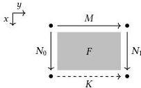

Cubical computational type theory 51

The general hcom also replaces the pair $(x \equiv 0 \hookrightarrow y.N_0, x \equiv 1 \hookrightarrow y.N_1)$ with an arbitrary collection of equation-path pairs, which may involve any number of interval variables. These are required to agree on their overlaps; if, for example, they include $y \equiv 0 \hookrightarrow x.N_0$ and $z \equiv 0 \hookrightarrow x.P_0$, then it must be the case that $x : \mathbb{I} \gg N_0[0/z] = P_0[0/y] \in A$. In effect, such a collection forms a frame into which a term may fit, which we call the *tube* of the composite. An hcom takes a term ($M$ in our example) that fits into the tube at one index $r$, which we call the *cap*, and produces a term that fits into the tube at any other index $s$. In particular, the picture above generalizes to $n$-dimensional open box filling: given an $n$-dimensional cube with one face missing, we can use hcom to produce a term that fits in the missing face.

**Computing with cubical terms** Of course, everything we have said so far is merely aspirational; we need to set up a computational setting in which these dreams come true. The main obstruction to that dream is the evaluation of coercion, terms of the form $\text{coe}_{x,A}^{r \to s}(M)$. Let us recall some intuition: a line of types $x : \mathbb{I} \gg A$ type is supposed to correspond to an isomorphism, with $\text{coe}_{x,A}^{0 \to 1}$ and $\text{coe}_{x,A}^{1 \to 0}$ executing the forward and backward functions of the isomorphism respectively. In particular, the evaluation of $\text{coe}_{x,A}^{r \to s}(M)$ *depends on the form of $x.A$*: we have to look at $A$ to determine what isomorphism it represents. If, for example, we have a path $P \in \text{Path}(U, \text{Bool}, \text{Bool})$, it could represent either the identity isomorphism $\text{Bool} \simeq \text{Bool}$ or the isomorphism that swaps $\text{tt}$ and $\text{ff}$. In the former case, we should have $\text{coe}_{x, P, x}^{0 \to 1}(\text{tt}) = \text{tt} \in \text{Bool}$; in the latter, we should have $\text{coe}_{x, P, x}^{0 \to 1}(\text{tt}) = \text{ff} \in \text{Bool}$.

The upshot of this situation is that we must be able to compute in a context with interval variables: we need to evaluate $x.A$ to examine it. This is a stark change of pace from Chapter 2, where our operational semantics only applied to *closed* terms. Fortunately, we do not need to be able to evaluate *all* open terms, just those that depend only on interval terms. For this chapter, those terms will be our “closed” terms.

When we evaluate terms containing interval variables, there is a question of *coherence*: how does substitution for interval variables interact with evaluation? Suppose, for example, that we have some $x : \mathbb{I} \gg M \in A$. Then $M$ should evaluate to some value: