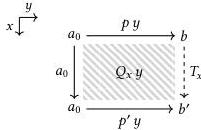

Programming in a cubical type theory 73

have an easier time if we take a look at $Q_x$ first. For this term, what we need is a two-dimensional term fitting in the following square boundary.

This is a perfect candidate for the application of homogeneous composition: we have a box with three fixed sides and one undetermined side ($T_x$, which is up to us to define as we like) that we must fill with a square term. We may therefore define $Q_x$ as follows.

$$Q_x := \lambda^\mathbb{I} y. \operatorname{hcom}_A^{0 \to y} (a_0; x = 0 \hookrightarrow z.p z, x = 1 \hookrightarrow y.p' z)$$

From the tube constraints of this composite, we have that $Q_0 = p \in \operatorname{Path}(A, a_0, b)$ and $Q_1 = p' \in \operatorname{Path}(A, a_0, b')$. If we define $T_x := Q_x 1$, we moreover see that $x : \mathbb{I} \gg Q_x \in \operatorname{Path}(A, a_0, T_x)$, and so

$$\lambda^\mathbb{I} x. \langle T_x, Q_x \rangle \in \operatorname{Path}((a : A) \times \operatorname{Path}(A, a_0, a), \langle b, p \rangle, \langle b', p' \rangle)$$

as desired. $\square$

**Lemma 3.2.3 (J for paths).** Let a $a_0 : A, a_1 : A, p : \operatorname{Path}(A, a_0, a_1) \gg B$ type be given with some $d : (a : A) \to B[a/a_0, a/a_1, \lambda^\mathbb{I} \dots a/p]$. Then $B$ is inhabited for any $a_0 : A, a_1 : A$, and $p : \operatorname{Path}(A, a_0, a_1)$.

*Proof.* Given $a_0 : A, a_1 : A$, and $p : \operatorname{Path}(A, a_0, a_1)$, we have two elements of the singleton type $(a : A) \times \operatorname{Path}(A, a_0, a)$: the canonical $\langle a_0, \lambda^\mathbb{I} \dots a_0 \rangle$ as well as $\langle a_1, p \rangle$. By **Lemma 3.2.2**, there is a path between these, some $Q$ of type $\langle a_0, \lambda^\mathbb{I} \dots a_0 \rangle \rightsquigarrow \langle a_1, p \rangle$. Fixing $a_0$, we can recast $B$ as a type family indexed by singletons like so.

$$c : (a : A) \times \operatorname{Path}(A, a_0, a) \gg B' := B[\operatorname{fst}(c)/a_1, \operatorname{snd}(c)/p] \text{ type}$$

Then we have $d a_0 \in B'[\langle a_0, \lambda^\mathbb{I} \dots a_0 \rangle/c]$. We obtain our desired result by coercing $d a_0$ along our path between the singletons: $\operatorname{coe}_{x.B'[Q_x/c]}^{0 \to 1} (d a_0) \in B'[\langle b_1, q \rangle/c]$. $\square$