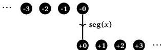

87

**Path constructors** Higher inductive types, conceived at a 2011 workshop in Oberwolfach by Bauer, Lumsdaine, Shulman, and Warren, enlarge the class of inductive types by allowing a new form of constructor, the path constructor. Originally proposed for **HoTT** and thus specified in terms of identity types, we describe HITs here in terms of the cubical interval. A path constructor is exactly what it sounds like: a term that constructs paths in an inductive type. As a simple and somewhat contrived first example, we might define the type of *integers* as a type with two ordinary (“point”) constructors and one path constructor.

**inductive** Int **where**
| neg(n : Nat) ∈ Int
| pos(n : Nat) ∈ Int
| seg(x : I) ∈ Int [x ≡ 0 ⇔ neg(zero) | x ≡ 1 ⇔ pos(zero)]

The first constructor defines a “negative” integer for every natural number, while the second defines a “positive” integer for every natural number. The final constructor expresses that negative zero is the same as positive zero by defining a path between them: a term $x: \mathbb{I} \gg \text{seg}(x) \in \text{Int}$ such that $\text{seg}(0) = \text{neg}(\text{zero}) \in \text{Int}$ and $\text{seg}(1) = \text{pos}(\text{zero}) \in \text{Int}$. Pictorially, the elements of Int look something like the following.

In this way, we define Int as the quotient of two copies of Nat by the relation that relates the two zeroes. We think of the point constructors as “zero-dimensional” elements of the type, while path constructors are “one-dimensional” elements; we can more generally consider $n$-dimensional constructors for $n > 1$, which would construct paths between paths and so on. The only special feature of path constructors, from a specification perspective, is that we should be able to specify their *boundary*, a collection of equations on interval terms at which the constructor should reduce. In the case of $\text{seg}(x)$, these are the requirements that $\text{seg}(0) = \text{neg}(\text{zero})$ and $\text{seg}(1) = \text{pos}(\text{zero})$.

Elimination from a higher inductive type also treats path constructors simply as ordinary constructors with boundary conditions. To define a function $(z : \text{Int}) \to D$, we must explain what to do on each of the constructor. For the negative elements, we need a term $n : \text{Nat} \gg T_{\text{neg}} \in D[\text{neg}(n)/z]$; for the positive elements, a term $n : \text{Nat} \gg T_{\text{pos}} \in D[\text{pos}(n)/z]$. For the path constructor, we require a path $x : \mathbb{I} \gg T_{\text{neg}} \in D[\text{neg}(x)/z]$ such that $T_{\text{neg}}[0/x] = T_{\text{neg}}[0/n]$ and $T_{\text{neg}}[1/x] = T_{\text{pos}}[0/n]$, mimicking the boundary conditions on the path constructor. In other words, we need functions for the positive and negative