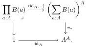

CAVALLO, HÖFER

Lemma 2.12 For any family of types \(a: A \vdash B(a)\), the type \(\prod_{a:A} B(a)\) is equivalent to the fiber of \(\pi_*: (\sum_{a:A} B(a))^A \to A^A\) at \(\mathrm{id}_A: A^A\), where \(\pi_*\) is post-composition with the first projection. Equivalently, the following strictly commutative square is a homotopy pullback:

Proof. We prove that the fiber of  \( \pi_{*} \)  at an arbitrary  \( t: A \to A \)  is equivalent to  \( \prod_{a:A} B(ta) \) . Define

\[
s \colon (\prod_ {a: A} B (t a)) \to \mathsf {f i b} _ {\pi_ {*}} (t) \quad r \colon \mathsf {f i b} _ {\pi_ {*}} (t) \to \prod_ {a: A} B (t a)
\]

\[
f \mapsto \langle \lambda a. \langle t a, f a \rangle , \mathsf {r e f l} \rangle \quad \langle g, \mathsf {r e f l} \rangle \mapsto \pi_ {1} \circ g
\]

where \(\pi_1\) is the second projection from \(\sum_{a:A} B(a)\). We have \(rs \stackrel{\circ}{=} \mathrm{id}\) and a homotopy \(sr \sim \mathrm{id}\) by path induction.

Theorem 2.13 In ITT, the following are logically equivalent:

(i) El: for all types \(A, B\), ceq-to-eq: \((A \cong B) \to (A \simeq B)\) is an equivalence,
(ii) for all types \(A, B\), ceq-to-eq: \((A \cong B) \to (A \simeq B)\) admits a homotopy section,
(iii) for all types \(A, B\) and every \(f: A \to B\), the type is-equiv(f) is a proposition,
(iv) for every type \(A\) and \(f\colon A\to A\), if \(f\sim \mathrm{id}_A\) then \(f = \mathrm{id}_A\),
(v) for all types \(A, B\) and every \(f: A \to B\), we have is-equiv \((f) \to \text{is-ceq}(f)\),
(vi) for all types \(A, B\) and every \(f: A \to B\), we have is-equiv \((f) \to \text{is-equiv}(f_{*})\),
(vii) Weak FE: for every family of contractible types \(a\colon A\vdash P(a)\), the type \(\prod_{a:A}P(a)\) is contractible,
(viii) FE: for every \(a\colon A\vdash B(a)\) and \(f,g\colon \prod_{a:A}B(a)\), the map \((f = g)\to (f\sim g)\) is an equivalence.

Proof. That (i) \(\Longrightarrow\) (ii) is immediate. For (ii) \(\Longrightarrow\) (iii), note that any homotopy section of ceq-to-eq exhibits is-equiv(f) as a homotopy retract of the proposition is-ceq(f) (cf. Corollary 2.7). For (iii) \(\Longrightarrow\) (iv), observe that a homotopy \(f \sim \mathrm{id}_A\) implies that \(f\) is a homotopy inverse of \(\mathrm{id}_A\). As \(\mathrm{id}_A\) is also its own homotopy inverse, (iii) implies that \(f = \mathrm{id}_A\). That (iv) \(\Longrightarrow\) (v) is immediate, and (v) \(\Longrightarrow\) (vi) follows from Lemma 2.5. The implication (vi) \(\Longrightarrow\) (vii), which appears in standard proofs of \(\mathsf{FE}_{\mathcal{U}}\) from \(\mathsf{UA}_{\mathcal{U}}\) [44, Theorem 4.9.4] [36, Theorem 17.3.2], follows from Lemma 2.12 and the fact that the fibers of an equivalence are contractible [36, Theorem 10.4.6]. That (vii) \(\Longrightarrow\) (viii) is due to Voevodsky; see for example [44, Theorem 4.9.5] or [36, Theorem 13.1.2]. That (viii) \(\Longrightarrow\) (i) is by definition of ceq-to-eq.

Theorem 2.13 relativizes to U. From this we recover that  \( UA_{U} \)  implies  \( FE_{U} \)  (and thus  \( CUA_{U} \) ).

Corollary 2.14 ITT \(\vdash\) UA\(_{\mathcal{U}}\) \(\leftrightarrow\) (CUA\(_{\mathcal{U}}\) \(\land\) FE\(_{\mathcal{U}}\)).

Proof. For  \( A, B: U \) , consider the following homotopy commutative triangle.

\[
(A = _ {\mathcal {U}} B) \xrightarrow [ \text {id - to - eq} ]{\text {id - to - ceq}} (A \cong B) \xrightarrow [ \text {id - to - eq} ]{\text {ceq - to - eq}} (A \simeq B)
\]

The map ceq-to-eq is an equivalence for all \(A, B: \mathcal{U}\) if and only if \(\mathsf{FE}_{\mathcal{U}}\) holds, by (i) \(\Longleftrightarrow\) (viii) of Theorem 2.13 in \(\mathcal{U}\). Thus, if both \(\mathsf{CUA}_{\mathcal{U}}\) and \(\mathsf{FE}_{\mathcal{U}}\) hold, then \(\mathsf{UA}_{\mathcal{U}}\) holds by 2-out-of-3 for equivalences.

Conversely, if  \( UA_{U} \)  holds, then id-to-eq has in particular a homotopy section for all  \( A, B: U \) . Post-composing these homotopy sections with id-to-ceq yields homotopy sections of ceq-to-eq for all  \( A, B: U \) .

5